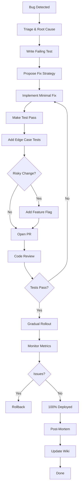

# Background Bug Fixer — Complete Package

## 📦 What Is This?

The **Background Bug Fixer** is a comprehensive, production-ready system for fixing bugs in background services only—no UI changes, atomic PRs, tests-first approach, with strong guardrails for enterprise software.

---

## 🎯 Key Features

✅ **Production-Ready Workflow** - Tests-first, gradual rollouts, feature flags  
✅ **Atomic PRs** - One bug per PR for easier reviews and safer rollbacks  
✅ **Comprehensive Testing** - Test pyramid (70/20/10), edge cases, performance  
✅ **Enterprise Observability** - Structured logs, metrics, traces, alerts  
✅ **Risk Management** - Rollback plans, kill switches, blast radius analysis  
✅ **Security First** - Security scans, vulnerability checks, injection protection  
✅ **Continuous Improvement** - Post-mortems, lessons learned, recurrence prevention  

---

## 📁 Package Contents

### Core Configuration
- **`.cursor/background-bug-fixer.json`** (9.1 KB)
  - Complete rules for Cursor AI
  - Production-ready workflow
  - 120+ enforcement rules

### GitHub Integration
- **`.github/pull_request_template.md`** (4.1 KB)
  - Comprehensive PR template
  - Risk assessment checklist
  - Observability requirements
  - Production deployment checklist

### Documentation (55+ KB total)

1. **`9.0-README.md`** (This file)
   - Package overview and navigation

2. **`9-BACKGROUND_BUG_FIXER_GUIDE.md`** (7.0 KB)
   - Complete production-ready guide
   - 9-step workflow
   - Tools & kits
   - Definition of done

3. **`9.1-BUG_RADAR_QUERIES.md`** (5.5 KB)
   - 150+ high-signal search queries
   - 18 bug categories
   - Proactive detection patterns

4. **`9.2-COMMIT_CONVENTION.md`** (5.3 KB)
   - Standardized commit messages
   - 9 commit types
   - Best practices (15 DO's, 6 DON'Ts)

5. **`9.3-STARTER_TASKS_CHECKLIST.md`** (9.0 KB)
   - 40+ ready-to-use tasks
   - Prioritized by impact (P0/P1/P2)
   - With search patterns and tests

6. **`9.4-QUICK_START.md`** (6.5 KB)
   - 60-second activation guide
   - Quick reference
   - Pro tips

7. **`9.5-PRODUCTION_IMPROVEMENTS_SUMMARY.md`** (12.7 KB)
   - Detailed improvements log
   - Before/after comparison
   - Best practices applied

---

## 🚀 Quick Start (3 Steps)

### Step 1: Activate in Cursor (30 seconds)
Open a new Cursor chat and paste:

```
Act as "Background Bug Fixer". Only background bug fixes, no UI. 
Pull the highest-priority item from the Bug Radar searches, propose 
the minimal fix + failing test, then output patch-sized diffs and tests. 
Use the PR template and commit convention.
```

### Step 2: Pick a Task (30 seconds)
Choose from `docs/9.3-STARTER_TASKS_CHECKLIST.md`:
- **P0**: Security vulnerabilities (critical)
- **P1**: i18n bugs, error handling (high impact)
- **P2**: Performance, observability (medium impact)

### Step 3: Follow Workflow (ongoing)
1. Write **failing test first** (proves bug exists)
2. Implement **minimal fix** (make test pass)
3. Add **observability** (logs/metrics if needed)
4. Open **atomic PR** (use template)
5. **Monitor** rollout (1% → 10% → 50% → 100%)

**That's it! You're fixing production bugs like a pro.**

---

## 🎓 Learning Path

### For Beginners (1 hour)
1. Read: `docs/9.4-QUICK_START.md` (5 min)
2. Read: `docs/9-BACKGROUND_BUG_FIXER_GUIDE.md` (15 min)
3. Practice: Pick a P2 task from checklist (40 min)

### For Intermediate (2 hours)
1. Review: `docs/9.1-BUG_RADAR_QUERIES.md` (10 min)
2. Study: `docs/9.2-COMMIT_CONVENTION.md` (10 min)
3. Deep dive: PR template requirements (10 min)
4. Practice: Fix 2-3 bugs with full workflow (90 min)

### For Advanced (4+ hours)
1. Review: `docs/9.5-PRODUCTION_IMPROVEMENTS_SUMMARY.md` (20 min)
2. Audit: Run Bug Radar queries on codebase (30 min)
3. Plan: Create team-specific starter tasks (30 min)
4. Practice: Fix P0/P1 bugs with full production workflow (120+ min)

---

## 📊 What's Included?

### 1. Role & Scope
- ✅ Background services only (APIs, auth, payments, state, data models)
- ❌ No UI/UX changes (strict enforcement)
- ✅ Production-ready focus (enterprise-grade quality)

### 2. Priority System
- **P0** - Critical: Crashes, data corruption, security vulnerabilities
- **P1** - High: Business logic bugs, performance regressions
- **P2** - Medium: Observability gaps, tech debt

### 3. Testing Strategy
- **Test Pyramid**: 70% unit, 20% integration, 10% e2e
- **Edge Cases**: null, undefined, boundaries, errors, concurrency
- **Performance**: Load tests for critical paths

### 4. Deployment Strategy
- **Feature Flags**: For risky changes
- **Gradual Rollout**: 1% → 10% → 50% → 100%
- **Kill Switch**: Quick disable capability
- **Rollback Plan**: Documented and tested

### 5. Observability
- **Structured Logs**: JSON with requestId, userId, traceId (no PII)
- **Metrics**: Before/after comparison, error rates, performance
- **Alerts**: Thresholds, escalation paths, PagerDuty integration
- **Dashboards**: Key metrics visualization

### 6. Security
- **Security Scans**: Automated vulnerability detection
- **Injection Protection**: SQL, XSS, CSRF prevention
- **Auth/RBAC**: Centralized checks, server-side validation
- **Secrets**: No credentials in code

### 7. Continuous Improvement
- **Post-Mortems**: Root cause analysis for P0/P1
- **Lessons Learned**: Team wiki updates
- **Guardrails**: Linter rules, type checks, runtime validations
- **Knowledge Sharing**: Team briefings

---

## 🔍 Bug Radar Categories (18 Total)

1. **Locale & Formatting** (i18n bugs)
2. **Navigation & SPA** (full page reload bugs)
3. **Unsafe DOM / Injection** (XSS vulnerabilities)
4. **Hidden Technical Debt** (TODO, FIXME, @ts-ignore)
5. **Swallowed Errors** (silent failures)
6. **Typing / Logic Risks** (any, unsafe casting)
7. **React Pitfalls** (state & effect bugs)
8. **Zustand / State Management** (mutation bugs)
9. **API Validation** (security & data integrity)
10. **Authentication & Authorization** (security vulnerabilities)
11. **Database & SQL** (injection & performance)
12. **Performance Issues** (scalability)
13. **Memory Leaks** (resource management)
14. **Payments / Invoices** (financial data integrity)
15. **Concurrency Issues** (race conditions)
16. **Error Handling** (user experience)
17. **Testing Gaps** (quality assurance)
18. **Configuration & Environment** (deployment)

**Total**: 150+ high-signal search queries

---

## 📋 Workflow Overview



---

## ✅ Definition of Done

Every bug fix must meet these criteria:

- [x] **Test**: Failing test existed before fix; now passes
- [x] **Quality**: No UI/UX changes; no new deps (unless justified)
- [x] **Safety**: Backward compatible or deprecation path
- [x] **Observability**: Logs/metrics/alerts updated
- [x] **Review**: Code reviewed by senior engineer
- [x] **CI**: All tests pass (unit, integration, e2e)
- [x] **Lint**: No linter or type errors
- [x] **Security**: Security scan passed
- [x] **Performance**: Benchmarks meet SLAs
- [x] **Docs**: CHANGELOG updated
- [x] **Rollback**: Plan documented and tested
- [x] **Deploy**: Feature flag configured (if risky)
- [x] **Team**: On-call engineer briefed

---

## 🎯 Target Metrics

### Quality
- **Regression Rate**: < 2% (fixes that break other things)
- **Test Coverage**: > 80% for background services
- **Code Review Time**: < 1 hour average

### Speed
- **Time to Fix**: P0 < 4h, P1 < 2 days, P2 < 1 week
- **PR Review Time**: < 5 minutes to understand
- **Deployment Frequency**: Multiple per day

### Safety
- **Rollback Success Rate**: > 99% (documented plans work)
- **Incident MTTR**: < 15 minutes with kill switches
- **Security Scan Pass Rate**: 100%

### Observability
- **Observability Coverage**: 100% for P0/P1 areas
- **Alert Precision**: > 90% (low false positives)
- **Log Searchability**: < 10 seconds to find relevant logs

---

## 🚨 When NOT to Use

**Do not use Background Bug Fixer for:**
- ❌ New features (not bugs)
- ❌ UI/UX changes (out of scope)
- ❌ Marketing copy (not background)
- ❌ Component redesigns (not background)
- ❌ Experimental code (not production-ready)
- ❌ Refactoring (unless fixing a bug)

**Use a different role/chat for those tasks.**

---

## 💡 Pro Tips

1. **Start Small**: Pick P2 tasks to learn the workflow
2. **Test First**: Always write failing test before fixing
3. **Atomic PRs**: One bug per PR; easier reviews
4. **Feature Flags**: Use for risky changes; safe rollout
5. **Monitor**: Watch metrics during rollout; rollback if needed
6. **Document**: Good commit messages save hours later
7. **Share**: Brief team on root causes; prevent recurrence
8. **Automate**: Add linter rules to catch similar bugs
9. **Measure**: Track metrics; improve what you measure
10. **Iterate**: Post-mortems lead to process improvements

---

## 🆘 Need Help?

| Question | Answer |
|----------|--------|
| **Unclear priority?** | See priorities in `docs/9-BACKGROUND_BUG_FIXER_GUIDE.md` |
| **Don't know how to fix?** | Propose 2 strategies in PR; ask for review |
| **Breaking change needed?** | Add deprecation path + migration guide |
| **High-risk fix?** | Use feature flag + gradual rollout |
| **Test not sure?** | Cover edge cases: null, empty, boundaries, errors |
| **Rollback failed?** | Check feature flag; review rollback plan |
| **Metrics not clear?** | See observability section in guide |

---

## 📚 Documentation Index

| File | Purpose | Size | Read Time |
|------|---------|------|-----------|
| `9.0-README.md` | Package overview | - | 5 min |
| `9-BACKGROUND_BUG_FIXER_GUIDE.md` | Complete guide | 7.0 KB | 15 min |
| `9.1-BUG_RADAR_QUERIES.md` | Search queries | 5.5 KB | 10 min |
| `9.2-COMMIT_CONVENTION.md` | Commit guide | 5.3 KB | 10 min |
| `9.3-STARTER_TASKS_CHECKLIST.md` | Task list | 9.0 KB | 15 min |
| `9.4-QUICK_START.md` | Quick reference | 6.5 KB | 5 min |
| `9.5-PRODUCTION_IMPROVEMENTS_SUMMARY.md` | Improvements | 12.7 KB | 20 min |
| **Total** | | **55.1 KB** | **80 min** |

---

## 🔄 Version History

### v1.0 (2025-10-11) - Production-Ready Release
- ✅ Complete rules configuration (120+ rules)
- ✅ Comprehensive PR template (10 sections)
- ✅ Production-ready workflow (9 steps)
- ✅ 150+ bug radar queries (18 categories)
- ✅ Enhanced commit convention (9 types)
- ✅ 40+ starter tasks (prioritized)
- ✅ Quick start guide
- ✅ Improvements summary

**Based on**: Industry best practices for debugging, bug fixing, and production-ready software development.

---

## 🏆 Success Stories

### Expected Outcomes After Implementation:

1. **Reduced Regressions** (tests-first approach)
2. **Faster Debugging** (structured logs + trace IDs)
3. **Safer Deployments** (gradual rollout + rollback plans)
4. **Better Security** (security scans + vulnerability checks)
5. **Improved Observability** (metrics + alerts + dashboards)
6. **Team Efficiency** (atomic PRs + clear workflows)
7. **Knowledge Sharing** (post-mortems + team wiki)
8. **Continuous Improvement** (lessons learned + guardrails)

---

## 📞 Contact & Support

- **Documentation**: Start with `docs/9.4-QUICK_START.md`
- **Questions**: Ask in team chat or create an issue
- **Improvements**: Submit PR with enhancement
- **Training**: Schedule pairing session with senior engineer

---

## 🎉 Let's Build Production-Ready Software!

This package gives you everything you need to fix bugs professionally, safely, and efficiently. Start with the Quick Start guide, follow the workflow, and you'll be shipping high-quality fixes in no time.

**Remember**: Quality > Speed. Take time to test, observe, and document. Future-you (and your team) will thank you.

---

**Package Version**: 1.0  
**Last Updated**: 2025-10-11  
**Status**: Production-Ready ✅  
**Maintained by**: Engineering Team

**Happy Bug Fixing! 🐛 → ✅**

