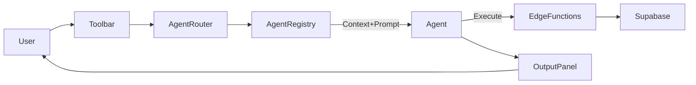

# 1.1- 🏗️ Monorepo Scaffolding Plan

---

## 🔰 Context (1–2 sentences)

Single codebase for **NBCON Engineering Co-Pilot**: one app, **plan-gated features** (Free → Basic → Pro → Enterprise), AI-first UX, Supabase-backed security, Stripe-driven subscriptions.

---

## 🎯 Objectives

- **Unify** web/mobile/backend under **pnpm workspaces** with strict boundaries.
- **Enforce** plan-driven access (`subscription_tier`, `is_admin`) end-to-end.
- **Embed AI** orchestration (toolbar, agents, registries) from day one.
- **Automate** CI/CD (lint, typecheck, unit, E2E, Supabase migrations).

---

## 🧭 High-Level System Diagram (ASCII)

```
[Developer]
   |
   v
[Monorepo (pnpm workspaces)]
   |-----------------------------|
   |  apps/web   apps/mobile     |      packages/ui  packages/utils  packages/types  packages/config
   |-----------------------------|
           |                                   |
           v                                   v
      [React/Vite]                       [Shared Libraries]
           |                                   |
           v                                   v
        [Build] ------------------------> [CI Pipelines]
           |                                   |
           v                                   v
[Supabase (Auth, Postgres, RLS, Edge)] <---- [Migrations/Seeds]
           |
           v
 [Stripe (Checkout, Webhooks)]
           |
           v
   [Entitlements → subscription_tier]

```

---

## 🧱 Tech Stack

| Layer | Tech |
| --- | --- |
| Frontend | React 18 + Vite + TypeScript + TailwindCSS + ShadCN + Framer Motion |
| Mobile | Expo (React Native) *(scaffolded, light)* |
| Backend | Supabase (Postgres, RLS, Auth, Edge Functions) |
| AI | TypeScript Orchestrator + Tool/Agent Registry (Section 8/9 alignment) |
| Payments | Stripe (Checkout, Billing Portal, Webhooks) |
| Testing | Vitest, Playwright, MSW, SQL RLS tests |
| Package | pnpm (workspaces) |
| CI/CD | GitHub Actions (build/test/migrate/deploy) |

---

## 🌳 Repository Layout (Tree)

```bash
nbcon/
├─ apps/
│  ├─ web/                  # Vite + React app (primary portal)
│  ├─ mobile/               # Expo shell (later roadmap)
│  └─ docs/                 # Static docs viewer (optional)
│
├─ packages/
│  ├─ ui/                   # ShadCN components, theme tokens, primitives
│  ├─ utils/                # Cross-app helpers, validators, formatting
│  ├─ types/                # Zod/TS types (Supabase, domain models)
│  └─ config/               # Tier maps, env schema, feature flags
│
├─ supabase/
│  ├─ migrations/           # SQL migrations (role drop, RLS rewrite)
│  ├─ functions/            # Edge Functions (stripe-webhook, checkout)
│  ├─ seeds/                # Seed & fixture data
│  └─ tests/                # SQL/RLS test scripts
│
├─ scripts/                 # DX scripts (migrate/seed/test/deploy)
│  ├─ migrate.sh
│  ├─ seed.sh
│  ├─ test.sh
│  └─ deploy.sh
│
├─ .github/workflows/       # CI: lint, typecheck, unit, e2e, db-migrate
│  ├─ ci.yml
│  ├─ test.yml
│  └─ deploy.yml
│
├─ pnpm-workspace.yaml
├─ tsconfig.base.json
├─ tailwind.config.ts
├─ .env.example
└─ README.md

```

---

## 🧩 Web App Structure (apps/web)

```bash
apps/web/src/
├─ app/
│  ├─ providers/            # Theme/Auth/Query providers
│  ├─ routes/               # AppRouter, TierAwareRoute
│  ├─ main.tsx
│  └─ App.tsx
│
├─ components/
│  ├─ portal/shared/
│  │  ├─ AppLayout.tsx
│  │  ├─ TierAwareAppSidebar.tsx
│  │  ├─ UnifiedDashboard.tsx
│  │  ├─ FeatureGate.tsx
│  │  └─ CoPilotToolbar.tsx
│  └─ ui/                   # Button, Card, Input, etc.
│
├─ features/                # Domain features (ai, projects, finance, ...)
│
├─ ai/
│  ├─ orchestrator.ts       # Router → Registry → Exec (agents/tools)
│  ├─ toolRegistry.ts
│  ├─ agentRegistry.ts
│  └─ sessionStore.ts
│
├─ hooks/
│  ├─ useAuthSession.ts
│  ├─ usePortalAccess.ts
│  ├─ useFeatureGate.ts
│  └─ useAiStore.ts
│
├─ shared/
│  ├─ types/                # auth, subscription, user
│  ├─ constants/            # TIERS, FEATURES, ROUTES
│  ├─ utils/
│  └─ services/
│     ├─ supabaseClient.ts
│     └─ repositories/      # projectRepo.ts, taskRepo.ts, paymentRepo.ts
│
├─ tests/
│  ├─ unit/
│  ├─ e2e/
│  └─ setup.ts
└─ styles/

```

---

## 🧭 Imports & Conventions

| Alias | Path |
| --- | --- |
| `@app/*` | `apps/web/src/app/*` |
| `@components/*` | `apps/web/src/components/*` |
| `@features/*` | `apps/web/src/features/*` |
| `@ai/*` | `apps/web/src/ai/*` |
| `@hooks/*` | `apps/web/src/hooks/*` |
| `@shared/*` | `apps/web/src/shared/*` |
| `@services/*` | `apps/web/src/shared/services/*` |

**Rules**

- Absolute imports only; collocate feature code; UI PascalCase, hooks camelCase.
- No `role` checks; **only** `subscription_tier` + `is_admin`.

---

## 🔐 Access & Data Model (Wire-in)

```
Frontend (usePortalAccess)  -> subscription_tier + is_admin
         │
         ├─ FeatureGate (UI gating)
         └─ TierAwareSidebar (visibility)
Backend  │
Supabase (RLS) -> USING (auth.uid() = user_id OR is_admin)
Stripe Webhooks -> updates profiles.subscription_tier

```

---

## 💳 Payments Pipeline (ASCII)

```
[UI] --(Checkout)--> [Edge: create-session]
   -> Stripe Checkout -> (success) -> [Stripe Webhook (Edge)]
   -> Map price_id → plan → update Supabase profiles.subscription_tier
   -> Realtime event → UI refresh gates

```

---

## 🤖 AI Orchestration (Flow)



---

## 🧪 Testing Matrix (scaffolding)

| Layer | Framework | Notes |
| --- | --- | --- |
| Unit | Vitest | utils, hooks, services |
| Integration | Supertest + Supabase client | API, Edge functions, RLS |
| E2E | Playwright | tier flows, checkout, gating |
| Visual | Percy/Chromatic | layout & theme regressions |
| SQL/RLS | psql scripts | policies, deny/allow cases |

---

## ⚙️ CI/CD Pipelines (GitHub Actions)

**ci.yml (core)**

- `pnpm install` (frozen lockfile)
- `pnpm run lint` + `pnpm run typecheck`
- `pnpm run build`
- `pnpm run test` (Vitest)

**test.yml (E2E)**

- Spin Supabase local (or test project)
- Run migrations + seeds
- `pnpm exec playwright test`

**deploy.yml**

- Gate on green checks
- `supabase db push` with tag
- Upload artifacts, invalidate CDN (if any)

---

## 🛡️ Security & RLS Essentials

- **Drop** `profiles.role`; add `subscription_tier` (enum) & `is_admin` (bool).
- **RLS** on user-data tables: `auth.uid() = owner_id OR is_admin`.
- **Audit** trigger for tier changes; store in `audit_log`.
- Stripe webhook secrets stored in ENV; verify signatures.

---

## 🧰 DX Scripts

| Command | Purpose |
| --- | --- |
| `pnpm dev --filter web` | Run web locally |
| `pnpm run typecheck` | TS types |
| `pnpm run test` | Vitest unit |
| `pnpm exec playwright test` | E2E |
| `pnpm run migrate` | Apply migrations |
| `pnpm run seed` | Seed data |
| `pnpm run build` | Prod build |

---

## 🗂️ .env.example (minimum)

```
VITE_SUPABASE_URL=
VITE_SUPABASE_ANON_KEY=

STRIPE_PUBLIC_KEY=
STRIPE_SECRET_KEY=
STRIPE_WEBHOOK_SECRET=

# Optional
VITE_APP_ENV=local

```

---

## 📦 Workspace Guards

- `tsconfig.base.json` path mapping for aliases.
- ESLint: no relative up-path imports across packages.
- Pre-commit: `lint-staged` (lint + typecheck on changed files).

---

## 📚 Docs to Produce

- `docs/ui-ux/CoPilot_UI_Spec.md`
- `docs/rls-guide/RLS_Migration_Spec.md`
- `docs/payments/Stripe_Integration.md`
- `docs/testing/Matrix.md`
- `docs/ai/Agent_Orchestration.md`

---

## 🧾 Rollout Phases & Tags

| Phase | Tag | Outcome |
| --- | --- | --- |
| S0 | `v2.0.0-alpha` | Monorepo initialized, CI green |
| S1 | `v2.0.1` | Unified layout + sidebar |
| S2 | `v2.0.2-db` | RLS complete, role dropped |
| S3 | `v2.0.3` | Toolbar beta + AI hooks |
| S4 | `v2.1.1-payments` | Stripe live + entitlement sync |
| S5 | `v2.3.0` | Production rollout |

---

## ✅ Section Checklist

### A. Core Setup

- [ ]  `pnpm-workspace.yaml`, `tsconfig.base.json`, Tailwind setup
- [ ]  CI pipelines: lint/typecheck/unit/E2E
- [ ]  `.env.example` committed, secrets in vault

### B. UI Unification

- [ ]  `AppLayout`, `TierAwareAppSidebar`, `UnifiedDashboard`
- [ ]  `FeatureGate` wired to `usePortalAccess`
- [ ]  Routes consolidated; legacy layouts removed

### C. Access & Data Model

- [ ]  Add `subscription_tier`, `is_admin` to `profiles`
- [ ]  Replace all role checks; expose `tierMeetsRequirement()`

### D. DB & RLS Cleanup

- [ ]  Drop `profiles.role`; finalize policies
- [ ]  Audit `pg_policies`; add `audit_log` trigger

### E. Testing & Documentation

- [ ]  Unit + E2E suites; RLS SQL tests
- [ ]  Docs portal updated; coverage badge in CI

### F. Toolbar & Enhancements

- [ ]  `CoPilotToolbar` + Quick-Actions registry
- [ ]  Realtime hook + telemetry events

### G. Stripe & Subscription (Sec.14 tie-in)

- [ ]  Edge checkout + webhook; price→tier map
- [ ]  Entitlement sync + E2E payment flow

---

## 🧠 Guidance Diagram (Flow Summary)

```
Commit → CI (lint/type/unit) → DB Migrate (Supabase) → E2E (Playwright)
   → Build Artifacts → Deploy → Stripe/Supabase Webhooks Live
   → Realtime Tier Updates → UI Gates (FeatureGate) → Observability

```

---

## 📌 Acceptance (Definition of Done)

- One layout, **no role forks**; plan gating visible & correct.
- Stripe→Supabase **tier sync < 60s**; realtime UI refresh.
- CI green on **lint, types, unit, E2E**; RLS tests pass.
- Docs published; version tagged per phase.

---