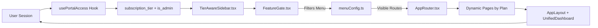
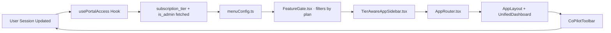

# 1.2- 🧭 Menu Navigation

> This diagram-driven structure shows how navigation dynamically adapts to the user’s plan tier (free, basic, pro, enterprise).
> 
> 
> Each module is controlled by the `FeatureGate` and `TierAwareSidebar` components.
> 

---

## 🧭 Core Flow Diagram

---

## 🧩 Plan-Based Visibility Matrix

| **Category** | **Free** | **Basic** | **Pro** | **Enterprise** |
| --- | --- | --- | --- | --- |
| **Core** | ✅ | ✅ | ✅ | ✅ |
| **Engineers / Jobs** | ✅ (partial) | ✅ | ✅ | ✅ |
| **Projects** | ✅ | ✅ | ✅ | ✅ |
| **AI Tools** | ❌ | ❌ | ✅ | ✅ |
| **Communication** | ✅ | ✅ | ✅ | ✅ |
| **Learning** | ✅ | ✅ | ✅ | ✅ |
| **Finance** | ✅ (subscription only) | ✅ | ✅ | ✅ |
| **Enterprise** | ❌ | ❌ | ❌ | ✅ |
| **Settings** | ✅ | ✅ | ✅ | ✅ |

---

## 🧭 Core

| Label | Icon | Route | plan |
| --- | --- | --- | --- |
| Overview | `LayoutDashboard` | `/overview` | `free` |
| Dashboard | `PresentationChartBar` | `/dashboard` | `free` |
| Calendar | `Calendar` | `/calendar` | `free` |

---

## 👷 Engineers / Jobs

| Label | Icon | Route | plan |
| --- | --- | --- | --- |
| Browse Engineers | `Users` | `/engineers` | `basic` |
| Browse Jobs | `Briefcase` | `/jobs` | `free` |
| Post New Job | `PlusCircle` | `/post-job` | `basic` |
| Applications | `DocumentText` | `/applications` | `free` |

---

## 📁 Projects

| Label | Icon | Route | plan |
| --- | --- | --- | --- |
| Projects | `Folder` | `/projects` | `free` |
| My Projects | `ClipboardDocumentList` | `/my-projects` | `free` |

---

## 🤖 AI Tools

| Label | Icon | Route | plan |
| --- | --- | --- | --- |
| AI Tools | `CpuChip` | `/ai-tools` | `pro` |
| AI Assistant | `Sparkles` | `/ai-tools/assistant` | `pro` |
| Project Planning | `Bars3BottomLeft` | `/ai-tools/planning` | `pro` |
| Cost & Budgeting | `CurrencyDollar` | `/ai-tools/budgeting` | `pro` |
| Execution & Coordination | `ArrowPath` | `/ai-tools/execution` | `pro` |
| Quality & Compliance | `CheckCircle` | `/ai-tools/quality` | `pro` |
| Communication & Reporting | `ChatBubbleLeftEllipsis` | `/ai-tools/communication` | `pro` |
| Closure & Handover | `ArchiveBoxArrowDown` | `/ai-tools/closure` | `pro` |

---

## 💬 Communication

| Label | Icon | Route | plan |
| --- | --- | --- | --- |
| Messages | `ChatBubbleOvalLeft` | `/messages` | `basic` |
| Network | `UserGroup` | `/network` | `basic` |

---

## 📚 Learning & Development

| Label | Icon | Route | plan |
| --- | --- | --- | --- |
| Learning | `BookOpen` | `/learning` | `free` |
| Development | `AcademicCap` | `/development` | `free` |

---

## 💼 Business & Finance

| Label | Icon | Route | plan |
| --- | --- | --- | --- |
| Finance | `Banknotes` | `/finance` | `pro` |
| Timesheets | `Clock` | `/timesheets` | `pro` |
| Subscription | `CreditCard` | `/subscription` | `free` |

---

## 🏢 Enterprise Ops

| Label | Icon | Route | plan |
| --- | --- | --- | --- |
| Workforce Mgmt | `UsersCog` | `/enterprise/workforce` | `enterprise` |
| Teams Mgmt | `Users` | `/enterprise/teams` | `enterprise` |
| Contracts & Compliance | `DocumentCheck` | `/enterprise/contracts` | `enterprise` |
| Company Profile | `BuildingOffice2` | `/enterprise/profile` | `enterprise` |
| Business Intelligence | `ChartPie` | `/enterprise/bi` | `enterprise` |

---

## ⚙️ Settings & Support

| Label | Icon | Route | plan |
| --- | --- | --- | --- |
| Help | `QuestionMarkCircle` | `/help` | `free` |
| Settings | `Cog6Tooth` | `/settings` | `free` |

---

## 🧭 Navigation Flow (All Tiers)

---

## 🧠 Summary

| **Category** | **Free** | **Basic** | **Pro** | **Enterprise** |
| --- | --- | --- | --- | --- |
| **Core** | ✅ Overview
✅ Dashboard
✅ Calendar | ✅ | ✅ | ✅ |
| **Engineers / Jobs** | ✅ Browse Jobs 
✅ Applications | ✅ Browse Engineers
✅ Post Job | ✅ | ✅ |
| **Projects** | ✅ Projects
✅ My Projects | ✅ | ✅ | ✅ |
| **AI Tools** | ❌ | ❌ | ✅ AI Tools
✅ AI Assistant
✅ Project Planning
✅ Cost & Budgeting
✅ Execution & Coordination
✅ Quality & Compliance
✅ Communication & Reporting
✅ Closure & Handover | ✅ (Full AI Suite + Enterprise Add-ons) |
| **Communication** | ✅ Messages | ✅ Messages
✅ Network | ✅ | ✅ |
| **Learning** | ✅ Learning
✅ Profile | ✅ | ✅ | ✅ |
| **Finance** | ✅ Subscription | ✅ Subscription
✅ Finance | ✅ Finance
✅ Timesheets | ✅ Finance
✅ Timesheets
✅ Payroll Forecast |
| **Enterprise** | ❌ | ❌ | ❌ | ✅ Workforce Mgmt
✅ Teams Mgmt
✅ Contracts & Compliance
✅ Company Profile
✅ Business Intelligence |
| **Settings** | ✅ Help✅ Settings | ✅ | ✅ | ✅ |
- **One source of truth**: `menuConfig.ts` + `FeatureGate`.
- **All menus adapt dynamically** to `subscription_tier`.
- **No role dependency** — pure plan visibility model.
- **TierAwareSidebar** controls what’s visible, while **FeatureGate** enforces logic.

---

Here’s the corrected Mermaid syntax for your **🧭 Navigation Flow (All Tiers)** diagram — fully compatible with Notion and Mermaid renderers (fixes the `()` parse error).

---