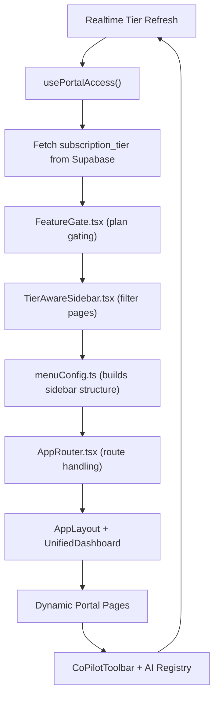
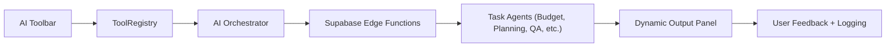
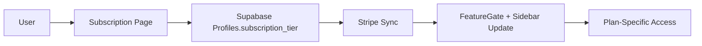
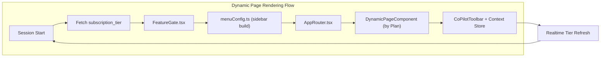

# 1.3- 🧾 Portal: Page Details & Purpose

> All access logic is now unified through subscription_tier.
> 
> 
> One portal, one codebase, tier-aware access.
> 
> No roles. No forks. No duplication.
> 

---

## 🧭 System Architecture — Access & Flow

---

## 🧩 Plan-Based Visibility Matrix

| **Category** | **Free** | **Basic** | **Pro** | **Enterprise** |
| --- | --- | --- | --- | --- |
| **Core Pages** | ✅ | ✅ | ✅ | ✅ |
| **Engineers / Jobs** | ✅ (partial) | ✅ | ✅ | ✅ |
| **Projects** | ✅ | ✅ | ✅ | ✅ |
| **AI Tools** | ❌ | ❌ | ✅ | ✅ |
| **Communication** | ✅ | ✅ | ✅ | ✅ |
| **Learning** | ✅ | ✅ | ✅ | ✅ |
| **Finance** | ✅ (subscription only) | ✅ | ✅ | ✅ |
| **Enterprise Ops** | ❌ | ❌ | ❌ | ✅ |
| **Settings & Help** | ✅ | ✅ | ✅ | ✅ |

---

## 🧭 Core Pages

### **Overview**

**Plan:** `free+`

- Unified landing page displaying activity summaries, usage meters, and alerts.
- Includes quick actions, tier badge display, and global notifications.
- Mirrors dashboard state between web and mobile.

### **Dashboard**

**Plan:** `free+`

- Central analytics interface with modular widgets: KPIs, task progress, resource usage.
- Widgets dynamically gated per plan tier.
- Integrates AI quick actions and live Supabase stats sync.

### **Calendar**

**Plan:** `free+`

- Multi-source event visualization.
- Syncs project deadlines, AI-generated milestones, and team availability.
- Supports multi-tier scaling (Free: 1 project, Basic+: 5+).

---

## 👥 Talent & Workflows

### **Browse Engineers**

**Plan:** `basic+`

- Global directory of verified engineers.
- Includes filters: specialization, certification, location, rating.
- Advanced insight metrics unlock at `pro+`.

### **Browse Jobs**

**Plan:** `free+`

- Intelligent job feed powered by project category and location.
- Recommends matches using tier-based personalization (AI filters activate at `pro+`).

### **Post New Job**

**Plan:** `basic+`

- 4-step guided job post wizard.
- Integrated AI estimator for scope, duration, and cost.
- Includes validation hooks to detect incomplete project info.

### **Applications**

**Plan:** `free+`

- Application pipeline management: shortlisting, interview scheduling, feedback.
- Syncs with messaging for live status updates.
- Tier-aware limit on concurrent active applications.

---

## 📁 Projects

### **Projects**

**Plan:** `free+`

- Unified project dashboard showing progress, costs, team members, and deliverables.
- List, board, and timeline views.
- Tier controls max concurrent projects (1 for Free, 5 for Basic, ∞ for Pro+).

### **My Projects**

**Plan:** `free+`

- Personalized workspace listing owned and participated projects.
- Linked to Supabase role context via `project_participants` RLS.
- Allows quick switching between projects with per-plan memory caching.

---

## 🤖 AI Tools Suite

> Tier-based modularity enforced by FeatureGate.tsx.
> 
> 
> Tool registry dynamically injects components based on `subscription_tier`.
> 

| **Tool** | **Plan** | **Function** |
| --- | --- | --- |
| **AI Tools (Hub)** | `basic+` / `pro+` | Central entry for all AI-powered modules. |
| **AI Assistant** | `basic+` | Contextual chatbot for workflows & document drafting. |
| **Project Planning** | `pro+` | WBS builder, risk matrix, timeline automation. |
| **Cost & Budgeting** | `pro+` | Budget planner, estimator, and ROI simulator. |
| **Execution & Coordination** | `pro+` | Auto-schedule generator and progress tracker. |
| **Quality & Compliance** | `pro+` | Standard checker and report generator. |
| **Communication & Reporting** | `pro+` | AI report compiler with templated outputs. |
| **Closure & Handover** | `pro+` | Packaging deliverables and generating closure docs. |

---

## 💬 Communication

### **Messages**

**Plan:** `basic+`

- Real-time communication with attachment and read receipts.
- Encrypted threads synced via Supabase Realtime.
- Integrates AI summary assistant (Pro+ only).

### **Network**

**Plan:** `basic+`

- Directory of verified professionals and organizations.
- Includes connection requests, recommendations, and mutuals.
- Pro-tier enables visibility analytics (connection insights).

---

## 📚 Learning & Identity

### **Learning**

**Plan:** `free+`

- Core education hub: tutorials, certifications, and progress tracking.
- Free tier: access to starter modules.
- Pro+: unlocks advanced training modules and AI learning coach.

### **Profile**

**Plan:** `free+`

- Unified identity and credential record.
- Contains CV, licenses, certifications, and verification badge.
- Editable fields gated by plan (Enterprise users: verified via admin).

---

## 💼 Finance & Subscription

| **Page** | **Plan** | **Purpose** |
| --- | --- | --- |
| **Finance** | `pro+` | Manage invoices, payments, and reconciliation logs. |
| **Timesheets** | `pro+` | Record work hours, approvals, and cost analysis. |
| **Subscription** | `free+` | Displays current plan, billing, upgrade flow. |

---

## 🏢 Enterprise Ops

| **Page** | **Plan** | **Purpose** |
| --- | --- | --- |
| **Workforce Management** | `enterprise` | Manage engineers, rates, and capacity planning. |
| **Teams Management** | `enterprise` | Organizational hierarchy, access control, roles. |
| **Contracts & Compliance** | `enterprise` | Manage vendor SLAs, audit logs, and document trails. |
| **Company Profile** | `enterprise` | Enterprise-level branding, data, and identity setup. |
| **Business Intelligence** | `enterprise` | Cross-project analytics, performance insights, and forecasting. |

---

## ⚙️ Settings & Support

| **Page** | **Plan** | **Purpose** |
| --- | --- | --- |
| **Help** | `free+` | Knowledge base, tutorials, and AI helpdesk assistant. |
| **Settings** | `free+` | Preferences, appearance, notifications, and 2FA configuration. |

---

## 🧠 Unified Routing Flow

---

## ✅ Developer Integration Checklist

| Stage | Task | Responsible | Status |
| --- | --- | --- | --- |
| S1 | `FeatureGate.tsx` refactored to plan-only gating | Frontend | ✅ |
| S2 | `menuConfig.ts` rewritten to dynamic tier map | Frontend | ✅ |
| S3 | Supabase schema updated (`subscription_tier TEXT`) | Backend | ✅ |
| S4 | RLS migration applied and verified | Backend | ✅ |
| S5 | TierAwareSidebar and DynamicRouter merged | Frontend | ⬜ |
| S6 | Toolbar AI integration (per plan) | AI Layer | ⬜ |
| S7 | Testing (Vitest + Playwright Smoke) | QA | ⬜ |
| S8 | Rollout tag v2.0 + Docs sync | PM | ⬜ |

---

## 🧩 Access Logic Summary

- **Free → Basic → Pro → Enterprise** hierarchy.
- Every component gated via `FeatureGate`.
- Sidebar and Router generated from unified `menuConfig.ts`.
- `subscription_tier` fetched at login → persisted to Zustand store.
- Stripe sync updates Supabase field; triggers sidebar rebuild.

---

**End of Page 1 — 🧾 Portal: Page Details & Purpose.**

Ready to proceed to Page 2 → **🗺️ Portal: Subscription Plans (Unified Diagram Edition)?**