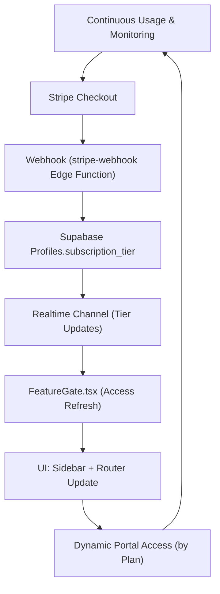
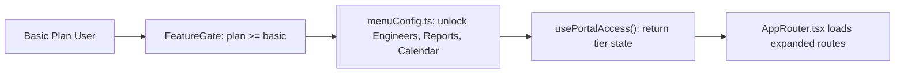
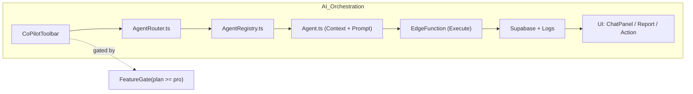
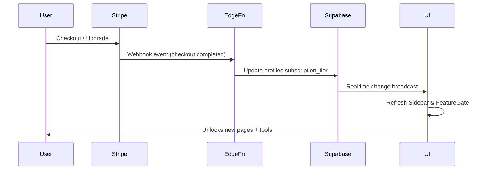
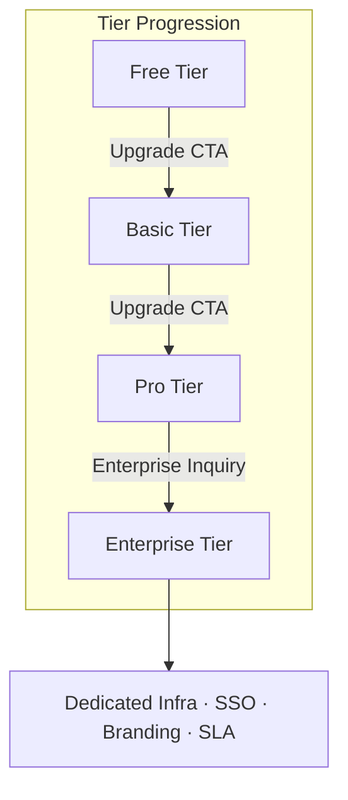
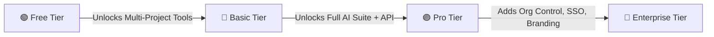
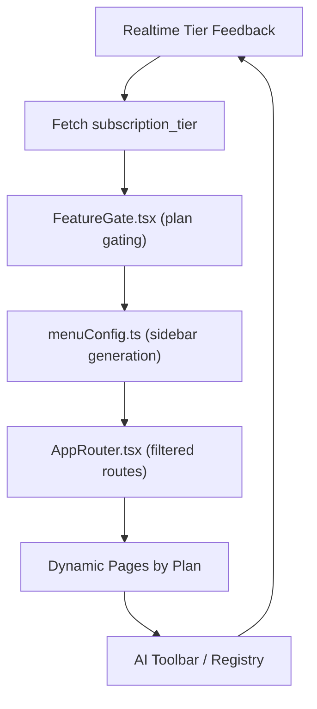

# 1.4- 🗺️ Portal: Subscription Plans

**Unified Diagram Edition — Tier Hierarchy & Capabilities (Build Spec v2.1)**

> NBCON Portal operates on a single subscription-based system:
> 
> 
> **Free → Basic → Pro → Enterprise**
> 
> Each higher tier inherits all features of those below, with additional capabilities and service guarantees.
> 
> Plan upgrades automatically propagate via Stripe → Supabase → UI sync (realtime).
> 

---

## 🧭 Tier Architecture — Data & Access Flow

---

## 🟢 Free Plan (Tier 0)

### **Overview**

- Designed for new users exploring the platform.
- Provides all essential tools to create, manage, and close one project.
- Encourages upgrade via visible gated UI hints (`FeatureGate` prompts).

### **Capabilities**

| Category | Features |
| --- | --- |
| **Core** | Dashboard, Overview, Calendar |
| **Jobs** | Browse Jobs, Applications |
| **Projects** | My Projects (1 active) |
| **AI Tools** | AI Assistant, Project Planning Tools (7 utilities) |
| **Communication** | Messages, Network (basic) |
| **Learning** | Free tutorials, CPD log access |
| **Finance** | Billing page, Invoice history, Checkout support |
| **Access Limitations** | 1 active project, 100k token AI quota, no specialized agents |

### **UI Behavior**

- All locked tools marked with 🔒 and an **Upgrade CTA** modal.
- `subscription_tier = 'free'` returned on session start → FeatureGate limits scope.

---

## 🔵 Basic Plan (Tier 1)

### **Overview**

- Ideal for active freelancers and small firms managing multiple projects.
- Expands AI usage quota, reporting depth, and support response speed.

### **Capabilities**

| Category | Features |
| --- | --- |
| **Projects** | Up to 5 concurrent projects |
| **AI** | Extended token quota (5× Free), access to AI Assistant & limited Toolset |
| **Reporting** | Advanced project analytics, custom export |
| **Calendar** | Multi-project timeline view |
| **Finance** | Expanded invoice and transaction records |
| **Support** | Priority response (under 24h) |
| **Gating** | Advanced AI tools (Budgeting, QA, Execution) still 🔒 |

### **Architecture Hooks**

---

## 🟣 Pro Plan (Tier 2)

### **Overview**

- Full-scale professional suite for engineers, teams, and firms requiring unlimited projects, automation, and AI orchestration.
- First tier with **Specialized AI Agents**, **API integrations**, and **White-Label outputs**.

### **Capabilities**

| Category | Features |
| --- | --- |
| **Projects** | Unlimited projects (no cap) |
| **AI Suite** | Full orchestration + all AI agents (planning, cost, compliance, QA, reports, closure) |
| **Integrations** | API access, webhook configuration |
| **Analytics** | Advanced dashboards, ROI & risk analytics |
| **Finance** | Automated reconciliation + forecasting tools |
| **Branding** | Partial white-label on reports and exports |
| **Support** | Dedicated account channel (business-hours SLA) |
| **Performance** | Priority compute & AI model tier |

### **Pro Flow — AI + Access**

---

## 👑 Enterprise Plan (Tier 3)

### **Overview**

- Tailored for organizations with multi-user management, advanced security, and SLA-backed reliability.
- Operates on dedicated infrastructure with full **white-label branding**, **governance controls**, and **AI fine-tuning** capabilities.

### **Capabilities**

| Category | Features |
| --- | --- |
| **Access** | All Pro-tier capabilities |
| **Enterprise Ops** | Workforce, Teams, Contracts, Company Profile, BI dashboards |
| **Security** | SSO / SAML, IP restrictions, audit logs |
| **Branding** | Full white-label (logo, colors, domain) |
| **AI** | Org-trained AI agents + private vector knowledge base |
| **Integrations** | ERP/CRM integrations (Salesforce, SAP, etc.) |
| **Support** | Dedicated account manager, SLA 99.9%, 24/7 priority support |
| **Governance** | Policy editor for access control, cost limits, and compliance tracking |

---

## 🧩 Plan Comparison Matrix

| **Feature** | **Free** | **Basic** | **Pro** | **Enterprise** |
| --- | --- | --- | --- | --- |
| **Active Projects** | 1 | 5 | Unlimited | Unlimited (Org) |
| **AI Quota** | 100k tokens | 500k tokens | Unlimited | Unlimited + Private AI |
| **AI Assistant** | ✅ | ✅ | ✅ | ✅ |
| **AI Agents** | 🔒 | 🔒 | ✅ | ✅ (custom-trained) |
| **Project Planning Tools** | ✅ | ✅ | ✅ | ✅ |
| **Cost & Budgeting Tools** | 🔒 | 🔒 | ✅ | ✅ |
| **Calendar & Scheduling** | ✅ (single project) | ✅ (multi-project) | ✅ (integrated) | ✅ (org-wide) |
| **Messages & Network** | ✅ | ✅ | ✅ | ✅ |
| **Reports & Analytics** | 🔒 | ✅ | ✅ (advanced) | ✅ (enterprise BI) |
| **Integrations & API** | 🔒 | 🔒 | ✅ | ✅ |
| **Branding & Customization** | 🔒 | 🔒 | ⚙️ Partial | ✅ Full |
| **Enterprise Ops** | ❌ | ❌ | ❌ | ✅ |
| **Support** | Standard | Priority | Dedicated | SLA-backed |
| **SSO / SAML** | ❌ | ❌ | ❌ | ✅ |
| **Storage & Data Limits** | 1GB | 5GB | 50GB | Unlimited |

---

## 🧭 Upgrade Flow — Stripe → Supabase Sync

---

## 🧠 Platform Tier Hierarchy

---

## ⚙️ Implementation Requirements

| Layer | Task | Status |
| --- | --- | --- |
| **Backend (Supabase)** | Add `subscription_tier` ENUM + default 'free' | ✅ |
| **Edge Functions** | Implement `stripe-webhook` with plan sync | ✅ |
| **Frontend Hooks** | `usePortalAccess()` returns tier → FeatureGate | ✅ |
| **Router** | Route filtering via `menuConfig.ts` | ✅ |
| **UI** | Upgrade modal + lock states | ✅ |
| **Docs** | Plan & feature documentation synced to `/docs/plans.md` | ⬜ |

---

## 📋 Developer Checklist — Subscription System

- [ ]  Stripe products created: `free`, `basic`, `pro`, `enterprise`
- [ ]  Webhook verified (`checkout.session.completed`)
- [ ]  Supabase table migration applied (`profiles.subscription_tier`)
- [ ]  `FeatureGate.tsx` tested across all routes
- [ ]  `menuConfig.ts` validated for tier-based filtering
- [ ]  Stripe Billing Portal link integrated into `/subscription` page
- [ ]  Upgrade modal tested for UX flow
- [ ]  RLS check: `auth.uid() = user_id OR is_admin`
- [ ]  Docs updated and version tagged `v2.1.0`

---

## ✅ Definition of Done

- All portal access and navigation strictly governed by `subscription_tier`.
- Real-time UI sync via Supabase channel works reliably.
- Stripe plan → Supabase sync < 60 seconds.
- Plan-based gating confirmed across routes, AI tools, and finance modules.
- All documentation, diagrams, and developer specs finalized under **Unified Diagram Edition v2.1**.

---

# 📊 Plan-Based Feature Summary

**(Unified Diagram Edition — Portal: Subscription Plans v2.1)**

This summary consolidates **all functional categories, tools, and privileges** across NBCON Portal’s four plan tiers: **Free**, **Basic**, **Pro**, and **Enterprise**.

✅ = available 🔒 = gated 🧩 = limited ⚙️ = configurable / partial.

---

| **Feature / Section** | **Free** | **Basic** | **Pro** | **Enterprise** |
| --- | --- | --- | --- | --- |
| **🏠 Dashboard & Core Navigation** | ✅ Basic overview, AI quick actions | ✅ Full dashboard + tier badge | ✅ Full access + analytics widgets | ✅ Full access + custom branding |
| **📦 Post New Job / Projects** | ✅ *1 active project* | ✅ *Up to 5 projects* | ✅ *Unlimited projects* | ✅ *Unlimited*, multi-team linked projects |
| **🧑‍🔧 Browse Engineers** | ✅ Directory view (limited filters) | ✅ Full filters, direct invites | ✅ Full filters + insights | ✅ Full access + private network overlay |
| **🧰 Browse Jobs** | ✅ General listing | ✅ Advanced filters | ✅ Advanced filters + AI matching | ✅ Enterprise job feed analytics |
| **🤖 AI Assistant (Chatbot)** | ✅ General assistant (usage capped) | ✅ Higher quota | ✅ Unlimited quota | ✅ Org-trained AI assistant |
| **🧠 Specialized AI Agents** | 🔒 Locked | 🔒 Locked | ✅ All specialized agents unlocked | ✅ Custom-trained org agents |
| **📐 AI Tools – Project Planning** | ✅ All 7 planning tools (core suite) | ✅ All 7 tools | ✅ All 7 tools + automation macros | ✅ Full suite + org templates |
| **💰 AI Tools – Advanced Categories** | 🔒 Locked | 🧩 Intermediate tools unlocked | ✅ All categories unlocked | ✅ All categories unlocked (with enterprise extensions) |
| **📅 Calendar & Scheduling** | ✅ Single project calendar | ✅ Multi-project calendar | ✅ External sync (Google/Outlook) | ✅ Org-wide scheduling + delegation |
| **💬 Messages (Client–Engineer Chat)** | ✅ Basic chat | ✅ Full chat + attachments | ✅ Smart summaries + pinned threads | ✅ Multi-channel enterprise chat |
| **🌐 Network (Community / Connections)** | ✅ View basic profiles | ✅ Full connections | ✅ Premium network + insights | ✅ Enterprise network + BI metrics |
| **📚 Learning Resources** | ✅ Tutorials, articles | ✅ Tutorials + certifications | ✅ Full catalog (advanced courses) | ✅ Custom corporate training modules |
| **📈 Reports & Analytics** | 🔒 Locked | ✅ Advanced reports | ✅ AI-driven dashboards | ✅ Org-wide BI dashboards + exports |
| **🧩 API & Integrations** | 🔒 Locked | 🔒 Locked | ✅ Public API & webhooks | ✅ Enterprise API + ERP/CRM connectors |
| **🎨 Custom Branding** | 🔒 Locked | 🔒 Locked | ⚙️ Partial (white-label exports) | ✅ Full white-label (logo, colors, domain) |
| **🏢 Enterprise Admin & SSO** | N/A | N/A | N/A | ✅ Full SSO / SAML + user management |
| **🧾 Finance & Billing** | ✅ View invoices | ✅ Detailed reports | ✅ Automated reconciliation | ✅ Multi-tenant finance dashboard |
| **🕒 Timesheets** | 🔒 Locked | 🔒 Locked | ✅ Active tracking + export | ✅ Linked timesheets + payroll integration |
| **🧭 AI Quota** | 100k tokens | 500k tokens | Unlimited | Unlimited + private AI namespace |
| **📊 Projects Limit** | 1 project | 5 projects | Unlimited | Unlimited (multi-org) |
| **📞 Support Level** | Standard (email) | Priority (under 24h) | Dedicated (direct line) | SLA-backed (24/7 + manager) |
| **🔐 Security & Governance** | Basic auth only | 2FA enabled | 2FA + API key auth | SSO, audit logs, access control |
| **📡 Performance Tier** | Shared compute | Shared + faster queue | Priority compute | Dedicated infrastructure |
| **🧱 Enterprise Ops** | ❌ | ❌ | ❌ | ✅ Workforce, Teams, BI, Compliance |
| **🧩 AI Model Access** | Base model | Optimized | Multi-model orchestration | Org-tuned + custom embeddings |
| **📦 Storage Limit** | 1 GB | 5 GB | 50 GB | Unlimited |
| **📋 SLA & Reliability** | Community-grade | Uptime 99.0 % | Uptime 99.5 % | SLA 99.9 % |
| **🔔 Upgrade Prompts** | Enabled (FeatureGate modals) | Enabled (Pro-only banners) | None (full access) | None (custom UX) |

---

## 🧭 Visual Summary — Tier Progression

---

## ⚙️ Technical Enforcement Flow

---

## ✅ Definition of Done (Subscription System)

| Area | Requirement | Status |
| --- | --- | --- |
| **Stripe Sync** | Webhook updates `subscription_tier` instantly | ✅ |
| **Supabase RLS** | Tier-enforced access validated | ✅ |
| **FeatureGate** | Deterministic per-plan rendering | ✅ |
| **UI Prompts** | Locked items show tier upgrade banners | ✅ |
| **Sidebar Filtering** | MenuConfig driven by tier state | ✅ |
| **Docs Sync** | `/docs/plans.md` updated (v2.1) | ✅ |
| **QA Testing** | Smoke + regression on plan gating | ⬜ |
| **Analytics Hooks** | Usage telemetry per plan | ⬜ |

---

### 📘 Summary

- NBCON Portal now runs under a **tier-gated architecture**, unified via `subscription_tier`.
- Stripe billing and Supabase sync ensure real-time entitlement propagation.
- FeatureGate + TierAwareSidebar enforce deterministic UI rendering.
- Every route, tool, and AI capability maps directly to the user’s active plan — from **Free** to **Enterprise** — without any legacy role checks or forks.

---