# 2.1- 🎯 Scope & Goal (Section 1)

---

## **Context**

Turn NBCON into a **single, unified Co-Pilot** for engineering and project management where **one user role** is governed by **subscription tiers** (Free → Basic → Pro → Enterprise).

The UI is **identical for all users**; features are **gated by tier**, and AI is **embedded across every workflow**.

---

## 🧭 **Objectives**

- **Unify experience:** One layout (`AppLayout`, `UnifiedDashboard`, `TierAwareSidebar`) — no role-based forks.
- **Plan-driven access:** Enforce `plan` + `is_admin` everywhere (no `role` logic).
- **AI-first workflows:** Toolbar, chat, tool registry, and domain agents integrated from day one.
- **Production discipline:** CI/CD, typed APIs, RLS correctness, and documentation aligned with code.

---

## 🚧 **Non-Goals**

- Custom enterprise workflows or branding (Enterprise-only scope).
- Agent fine-tuning with proprietary client data (covered in Sections 8–9).
- Mobile parity (will arrive later in `apps/mobile`).

---

## 👤 **Primary Personas**

| Persona | Core Actions |
| --- | --- |
| **Project Owner** | Creates jobs, projects, budgets, timelines |
| **Engineer / Vendor** | Applies, delivers, logs time |
| **Org Admin (is_admin = true)** | Manages billing, quotas, compliance |

---

## 🗺️ **Platform Scope Diagram**

```mermaid
flowchart LR
  subgraph UserSide["👤 User Layer"]
    A1["Client / Engineer / Admin"]
  end

  subgraph UISide["🖥️ NBCON Interface"]
    B1["Web (Vite + React + Tailwind)"]
    B2["Mobile (Expo + React Native)"]
  end

  subgraph Core["⚙️ Core Services"]
    C1["Supabase Auth + Postgres + RLS"]
    C2["Supabase Edge Functions (API)"]
    C3["Stripe Payments"]
    C4["Realtime + Storage"]
  end

  subgraph AI["🤖 AI Subsystems"]
    D1["Co-Pilot Toolbar"]
    D2["Domain Agents (Civil, Electrical, Survey, etc.)"]
    D3["Vector DB / Knowledge Layer"]
  end

  subgraph Ops["📊 Monitoring & Governance"]
    E1["CI/CD Pipelines"]
    E2["Audit Logs + Telemetry"]
  end

  A1 --> B1 & B2
  B1 & B2 --> C2
  C2 --> C1
  C2 --> C3
  C2 --> D1
  D1 --> D2
  D2 --> D3
  C1 --> E2
  C3 --> E2
  D3 --> E2
  E1 --> E2

```

---

## 📌 **Success Criteria**

- Single dashboard & menu across plans — no role forks.
- Feature gates rely solely on `subscriptionTier`.
- RLS: 0 `profiles.role` references; all via `is_admin`.
- Stripe → Supabase sync ≤ 60 s.
- Playwright smoke (Free / Basic / Pro / Enterprise) ✅.
- Docs complete (UI Spec • RLS Guide • Payments Spec • Testing Matrix).

---

## 📏 **North-Star Metrics**

| Metric | Target |
| --- | --- |
| Activation | ≥ 70 % new users complete first AI plan in 24 h |
| Upgrade Intent | Upgrade clicks / DAU > 15 % |
| Reliability | P95 load < 2 s · Policy errors < 0.1 % |
| AI Quality | ≥ 80 % positive feedback on first response |

---

## 🔗 **System Flow Diagram**

```mermaid
flowchart LR
  User["👤 User Request (Click / Prompt)"]
  Router["🔀 AppRouter → FeatureGate Check"]
  Access["🔐 subscriptionTier + is_admin Validation"]
  API["⚙️ Edge Function / Supabase API"]
  DB["🗄️ RLS Enforced Postgres Query"]
  AI["🤖 AgentRouter → Domain Agent → VectorDB"]
  Stripe["💳 Stripe Billing / Webhook"]
  Output["📤 UI Response → Dashboard / Chat / Report"]

  User --> Router
  Router --> Access
  Access --> API
  API --> DB
  API --> AI
  API --> Stripe
  AI --> Output
  DB --> Output
  Stripe --> Output

```

---

## 🧩 **In-Scope / Out-of-Scope**

| Area | In-Scope Now | Out-of-Scope (later) |
| --- | --- | --- |
| UI | Unified layout + toolbar + FeatureGate | Mobile parity · White-label (Sec 13) |
| Access | `subscriptionTier` + `is_admin` | Role matrix |
| DB/RLS | Drop `role`, migrate policies | Cross-tenant analytics |
| Payments | Stripe checkout + webhook sync | Usage-based billing |
| AI | Toolbar + assistant + tool registry | Enterprise fine-tune (Sec 8–9) |

---

## ✅ **Scope Checklist**

| Task | Owner | Status | Notes |
| --- | --- | --- | --- |
| Confirm single-role, plan-gated scope | Product | ☐ | Supersedes legacy UX |
| Approve 4 plan definitions & limits | Product | ☐ | Free / Basic / Pro / Enterprise |
| Lock North-Star metrics | Product | ☐ | Add to analytics spec |
| Finalize DoD for S1–S3 | Eng Lead | ☐ | Used by CI gates |
| Sign-off dependency map | PM / Tech Lead | ☐ | Unblocks execution |

---

## 🧪 **Acceptance Tests**

- **AT-1:** Free user sees same layout as Pro; Pro-only items show lock + upgrade.
- **AT-2:** Free → Pro upgrade unlocks AI tools instantly.
- **AT-3:** E2E asserts no `role` forks in DOM.
- **AT-4:** RLS scan → 0 `role='admin'`; admin access via `is_admin`.

---

## ⚠️ **Risks & Mitigations**

| Risk | Impact | Mitigation |
| --- | --- | --- |
| Legacy role forks | Fragmented UX | Code mod + E2E “No Role Fork” test |
| Stripe webhook delay | Wrong gates | Idempotent queue + manual refresh |
| RLS regression | Data exposure | Policy tests + staging audit |
| Agent bloat | Slow UI | Lazy load agents via toolbar registry |

---

## 📚 **Artifacts to Produce**

- `docs/ui-ux/CoPilot_UI_Spec.md`
- `docs/rls-guide/RLS_Migration_Spec.md`
- `docs/payments/Stripe_Integration.md`
- `docs/testing/Matrix.md`

---

## 🔄 **Change Control**

All scope changes must include an **ADR** (`docs/architecture/adrs/`) capturing UI, RLS, and Stripe impact.

---