# 2.10 - 🗺️ Implementation Roadmap (Section 10)

---

## 🎯 Objective

Define a **phased, verifiable rollout strategy** for NBCON Engineering Co-Pilot — aligning feature delivery, testing cycles, and stakeholder accountability across the monorepo.

This roadmap ensures every build step moves from **prototype → validation → production → scaling** with zero guesswork.

---

## 🧩 1. Rollout Philosophy

NBCON’s approach is **incremental, test-driven, and data-backed**:

- Each phase introduces one *functional layer* (UI → Data → AI → Payments → Deployment).
- Every release passes through the CI/CD test gate before merging.
- Documentation and QA are version-controlled with each milestone (tagged `vA.x`, `vB.x`, etc.).
- Rollouts are reversible — every deploy has rollback scripts baked into the Supabase Edge pipeline.

---

## 🧱 2. Master Roadmap Structure

| Phase | Theme | Key Outcome | Dependency |
| --- | --- | --- | --- |
| **A** | UI Unification | Unified React + Tailwind layout, i18n + RTL verified | Core monorepo ready |
| **B** | Access & Data Model | Role-based routing + Supabase RLS | A |
| **C** | Database Cleanup | Migrations, policies, and data sync verified | B |
| **D** | Testing & Docs | CI/CD, Playwright, lint/typecheck | C |
| **E** | Toolbar & Enhancements | Co-Pilot Toolbar + Command Center UI | D |
| **F** | Stripe Integration | Payment & subscription layer deployed | E |
| **G** | Portal Navigation | Tier-based feature gating and UI visibility | F |
| **H** | AI Agent Ecosystem | Domain + Meta agents live, pgvector embedded | G |
| **I** | Deployment Enforcement | CI workflows + E2E smoke suite | H |

---

## ⚙️ 3. Visual Flow — System Rollout Pipeline

```mermaid
flowchart LR
  A["🎨 UI Unification"] --> B["🔐 Access Model"]
  B --> C["🧩 DB + RLS Cleanup"]
  C --> D["🧪 Testing & Documentation"]
  D --> E["🧰 Toolbar & Enhancements"]
  E --> F["💵 Stripe Integration"]
  F --> G["🧭 Portal Navigation & Tier Visibility"]
  G --> H["🤖 AI Agent Coverage Expansion"]
  H --> I["🚀 Testing & Deployment Enforcement"]
  I --> J["📦 Production & Scaling"]

  style J fill:#00b894,stroke:#00695c,stroke-width:2px,color:#fff

```

---

## 🧠 4. Milestone Breakdown

| Milestone | Description | Deliverables |
| --- | --- | --- |
| **M1 — Monorepo Bootstrapped** | Folder structure, pnpm workspace, base configs. | ✅ `/apps`, `/packages`, `/scripts` |
| **M2 — Unified Layout Complete** | Dashboard, sidebar, theming, i18n. | ✅ `/apps/web/src/layouts` |
| **M3 — RLS + Access Model Stable** | Supabase schema + row-level security verified. | ✅ `/db/policies` |
| **M4 — Testing Stack Live** | Jest + Playwright integrated, CI workflow passes. | ✅ `.github/workflows/ci.yml` |
| **M5 — Toolbar MVP** | Co-Pilot toolbar with 5 AI tools. | ✅ `/packages/ui-toolbar` |
| **M6 — Stripe Connected** | Webhooks, customer portal, plan tiers. | ✅ `/apps/web/api/stripe` |
| **M7 — Portal Tier Enforcement** | Free/Basic/Pro/Enterprise UI gating. | ✅ `FeatureGate.tsx` |
| **M8 — AI Agents Online** | Domain + Meta agents live with vector DB. | ✅ `/packages/agents` |
| **M9 — Full E2E Deployment** | CI/CD + Smoke test suite on staging. | ✅ `tests/e2e` |
| **M10 — Production Launch** | Stable release `v1.0.0` tagged and deployed. | ✅ `main` branch protected merge |

---

## 🧮 5. Validation Gates

| Gate | Scope | Trigger | Validator |
| --- | --- | --- | --- |
| **G1 – Build Verification** | Typecheck, lint, format | `pnpm run check` | CI |
| **G2 – Unit & E2E Tests** | Jest + Playwright | `pnpm test` | QA |
| **G3 – Feature Review** | Cross-team peer review | PR merge | Leads |
| **G4 – Deployment Dry Run** | Supabase edge preview | Staging | DevOps |
| **G5 – Production Rollout** | Main push, tagged version | `main` branch | Release Manager |

---

## 📈 6. KPIs & Health Metrics

| Metric | Target | Validation |
| --- | --- | --- |
| Test coverage | ≥ 85% | Jest + Playwright summary |
| CI build success | ≥ 95% | GitHub Actions logs |
| Rollback time | < 5 min | Supabase + Cloudflare scripts |
| Issue turnaround | ≤ 24 hr | Linear issue tracker |
| Deployment uptime | 99.9% | Cloudflare analytics |

---

## 🧾 7. Deliverables Checklist

✅ Phase map from A → I

✅ Mermaid rollout diagram (visual roadmap)

✅ CI/CD workflow complete

✅ QA test gates integrated

✅ Deployment matrix (staging → prod)

✅ Milestone-based documentation index

---

## 🧩 8. Key Takeaway

Section 10 transforms the Co-Pilot documentation into a **real implementation pipeline**, not just a vision.

It defines *when*, *what*, and *who* across all builds — giving NBCON Engineering Co-Pilot a roadmap that can be audited, executed, and improved continuously.

It also provides the structural backbone referenced by **Section 11 (Post-Launch Monitoring)** and **Section 16 (Deployment Enforcement)**.

---