# 2.11 - 🔁 Post-Launch Monitoring & Continuous Improvement  (Section 11)

---

## 🎯 Objective

Establish a **continuous improvement framework** for NBCON PRO that ensures platform reliability, performance transparency, and rapid post-release iteration.

Every production deployment becomes *a monitored experiment* — tracked, measured, and refined through feedback loops.

---

## 🧩 1. Monitoring Philosophy

NBCON operates on the principle of **observe → analyze → optimize**:

- All user interactions, agent responses, and transactions are logged with real-time metrics.
- Every feature launch includes KPIs and rollback criteria.
- The system learns from production — retraining AI models, updating documentation, and adjusting RLS rules automatically.

**Goal:** A platform that improves itself over time, not one that just “stays online.”

---

## ⚙️ 2. Observability Stack

| Layer | Tool | Description | Status |
| --- | --- | --- | --- |
| **Frontend Monitoring** | LogRocket / Sentry | Capture UI errors, latency, and user flows. | 🟢 Active |
| **Backend Metrics** | Supabase Logs + OpenTelemetry | Track DB query time, API latency, and error ratios. | 🟢 Active |
| **AI Performance** | Agent Analytics Dashboard | Measures token usage, agent success rate, accuracy. | 🟢 Active |
| **CI/CD Watchdog** | GitHub Actions + Status Checks | Alerts on failed workflows, deployment regressions. | 🟢 Active |
| **Uptime & Availability** | Cloudflare Health Monitor | Checks public endpoints and functions every minute. | 🟢 Active |

---

## 🧠 3. Post-Launch Feedback Pipeline

```mermaid
flowchart LR
  User["👤 User Action / Feedback"] --> Tracker["📈 Telemetry Collector"]
  Tracker --> LogDB["🗄️ Supabase Logs"]
  LogDB --> Analyzer["🧠 AI Analyzer (Pattern Detection)"]
  Analyzer --> Dashboard["📊 Ops Dashboard"]
  Dashboard --> DevOps["🧑‍💻 DevOps / Engineering"]
  DevOps --> Update["⚙️ Fix / Retrain / Optimize"]
  Update --> Deploy["🚀 Redeploy via CI/CD"]
  Deploy --> Tracker

  style Analyzer fill:#6c5ce7,stroke:#341f97,stroke-width:2px,color:#fff
  style Deploy fill:#00b894,stroke:#00695c,stroke-width:2px,color:#fff

```

**Description:**

Every user action triggers a data collection event.

An AI Analyzer identifies repetitive issues, low agent accuracy, or UI friction points.

Developers receive automated improvement suggestions through the dashboard — closing the feedback loop.

---

## 🧱 4. Continuous Improvement Framework

| Stage | Description | Tool / Action |
| --- | --- | --- |
| **Detect** | Identify bugs, user drop-offs, or performance bottlenecks. | Sentry + LogRocket |
| **Diagnose** | Classify issue type (UI, backend, AI logic, RLS). | Supabase Log Explorer |
| **Design Fix** | Plan resolution or retraining task. | Linear Issue Tracker |
| **Deploy** | Implement fix, trigger CI/CD tests. | GitHub Actions |
| **Document** | Update `/docs` or agent playbook. | Docs Sync Bot |
| **Measure** | Compare pre- vs post-fix metrics. | Metrics Dashboard |

---

## 🔄 5. AI Feedback Integration

| Data Source | Use Case | Outcome |
| --- | --- | --- |
| **Agent logs** | Identify weak prompts, recurring errors. | Fine-tune prompt templates. |
| **User corrections** | Capture manual edits to agent output. | Update retraining dataset. |
| **Performance analytics** | Token cost, latency, success rate. | Optimize tool selection per tier. |
| **Support tickets** | Aggregate user complaints by feature. | Auto-prioritize bug fixes. |

All this data is automatically routed to `AgentFeedbackPipeline.ts` — which syncs into Supabase, feeding future retraining cycles (per Section 8).

---

## 📈 6. KPI Dashboard

| Category | Metric | Target | Action Threshold |
| --- | --- | --- | --- |
| **System Uptime** | ≥ 99.9 % | Investigate < 99.5 % |  |
| **Error Rate** | ≤ 0.5 % | Escalate > 1 % |  |
| **Page Load** | ≤ 2 s | Optimize > 3 s |  |
| **Agent Accuracy** | ≥ 90 % | Retrain < 80 % |  |
| **User Retention (30 d)** | ≥ 70 % | Run UX review < 60 % |  |
| **Support Response** | ≤ 2 h | Escalate > 4 h |  |

---

## 🧮 7. Post-Release Review Cycle

| Phase | Frequency | Deliverables |
| --- | --- | --- |
| **Weekly QA Sync** | Every 7 days | Bug report + open issue summary |
| **Monthly Agent Review** | Every 30 days | Retraining dataset, accuracy metrics |
| **Quarterly System Audit** | Every 90 days | RLS, access, and performance compliance |
| **Annual Product Review** | Yearly | Strategic roadmap update (next-gen AI, tools) |

---

## 🧾 8. Deliverables Checklist

✅ Monitoring stack deployed (frontend + backend)

✅ Log aggregation and alerting configured

✅ AI Analyzer + Feedback pipeline functional

✅ Ops dashboard built in Supabase / Metabase

✅ KPI table reviewed and validated

✅ Continuous improvement cadence documented

---

## 🧩 9. Key Takeaway

Section 11 converts NBCON PRO from a **static product into a living platform** — one that observes, learns, and evolves.

Every deployment after launch becomes an opportunity for refinement, driving accuracy, stability, and user satisfaction upward with each cycle.

This feeds directly into **Section 12 – Governance & Scaling Framework**, where these monitoring insights formalize into policy and organizational scalability.

---