# 2.12 - 🏛️ Governance & Scaling Framework (Section 12)

---

## 🎯 Objective

Establish a **governance model** and **scaling structure** that ensures NBCON Engineering Co-Pilot grows sustainably — with clear ownership, compliance, and quality controls as new features, agents, and integrations roll out.

---

## 🧩 1. Purpose & Principles

NBCON’s governance model is designed to maintain:

- **Transparency** — every feature, dataset, and decision is traceable.
- **Accountability** — each domain (AI, UI, Backend, Product Ops) has defined owners.
- **Scalability** — systems grow horizontally (new tools, agents) without breaking policies.
- **Compliance** — all operations align with **KSA PDPL**, internal audit, and Aramco-grade standards.

---

## ⚙️ 2. Governance Layers

| Layer | Description | Responsible Unit |
| --- | --- | --- |
| **Product Governance** | Defines vision, roadmap, and product-tier alignment. | Product Ops / Executive |
| **Technical Governance** | Oversees code quality, architecture, and versioning. | Engineering |
| **AI Governance** | Ensures ethical AI use, retraining oversight, and accuracy validation. | AI Team + Compliance |
| **Data Governance** | Manages Supabase, RLS, backups, and audit trails. | Backend / DevOps |
| **Operational Governance** | Manages rollout, risk register, and deployment runbooks. | Release Management |

---

## 🧠 3. Governance Flow Diagram

```mermaid
flowchart LR
  ProductOps["🎯 Product Ops"] --> TechLead["⚙️ Tech Lead / DevOps"]
  TechLead --> AIGovern["🤖 AI Governance Board"]
  AIGovern --> DataSec["🔒 Data Governance / PDPL"]
  DataSec --> QA["🧪 QA & Audit Team"]
  QA --> Exec["🏛️ Executive Review"]
  Exec -->|Sign-off| Release["🚀 Deployment"]
  Release --> Monitor["📊 Monitoring & Improvement (Section 11)"]
  Monitor --> ProductOps

  style Exec fill:#6c5ce7,stroke:#341f97,stroke-width:2px,color:#fff
  style Release fill:#00b894,stroke:#00695c,stroke-width:2px,color:#fff

```

**Flow Summary:**

Every change passes through governance checkpoints — from product design → technical validation → AI compliance → data security → QA → final approval.

The loop closes into continuous monitoring, ensuring governance is *ongoing*, not one-time.

---

## 🧱 4. Ownership & Roles

| Role | Responsibility | Tools / Deliverables |
| --- | --- | --- |
| **Product Owner** | Defines roadmap, manages Notion checklist, signs off milestones. | Roadmap + FeatureDocs |
| **Tech Lead** | Approves merges, ensures CI/CD health, code quality. | GitHub Actions + Code Reviews |
| **AI Governance Lead** | Oversees prompt safety, retraining quality, dataset compliance. | AI Metrics Dashboard |
| **Data Protection Officer (DPO)** | Ensures PDPL compliance and secure data access. | RLS Policies + Backup Logs |
| **QA Engineer** | Validates every build, documents test coverage and bugs. | Playwright + Test Reports |
| **Release Manager** | Publishes changelogs, manages rollback protocols. | `Rollout_Runbook.md` |

---

## 🔐 5. Compliance Controls

| Control | Description | Enforcement |
| --- | --- | --- |
| **PDPL / GDPR Alignment** | User data anonymization, access limitation. | Database RLS + Policies |
| **Change Log Transparency** | Every merge and deployment logged to changelog. | GitHub + Linear Sync |
| **Audit Logging** | Activity tracking (admin actions, API calls). | Supabase Audit Tables |
| **Data Retention** | Define 90-day retention for logs, 1-year backups. | Scheduled Backup Jobs |
| **Access Reviews** | Quarterly check of permissions + ownership. | Governance Board Review |

---

## 🧮 6. Scaling Framework

### Horizontal Scaling

- Add new **AI agents** or tools without architecture refactor.
- Utilize shared context (`AgentRegistry`, `pgvector`) for plug-and-play extension.
- Auto-register new features through `FeatureRegistry.ts`.

### Vertical Scaling

- Increase concurrent user capacity (Supabase + Cloudflare).
- Expand analytics dashboards for multi-tenant usage.
- Migrate storage tiers dynamically based on usage load.

### Governance Scaling

- Every new module must include:
    - Ownership record in `OWNERS.md`
    - Documentation page under `/docs/governance/`
    - Monitoring hooks registered in Supabase logs

---

## 📈 7. Governance Metrics

| Category | KPI | Target | Review Frequency |
| --- | --- | --- | --- |
| **Compliance** | 100% PDPL adherence | Monthly |  |
| **Code Quality** | ≤ 1 blocker issue per release | Per sprint |  |
| **AI Transparency** | 100% retraining audit logs | Quarterly |  |
| **Access Accuracy** | 0 unauthorized access attempts | Continuous |  |
| **Governance Reviews** | ≥ 90% attendance rate | Monthly |  |

---

## 🧾 8. Deliverables Checklist

✅ `OWNERS.md` (roles + emails)

✅ `Governance_Policy.md` (full policy statement)

✅ PDPL compliance plan approved

✅ QA + audit pipelines validated

✅ Rollout_Runbook governance appendix added

✅ Quarterly audit cycle defined

---

## 🧩 9. Key Takeaway

Section 12 anchors NBCON PRO with a **living governance and scaling framework** —

a balance between control and growth.

It ensures that as the platform scales in size, agents, and clients, it never loses traceability or compliance discipline.

This structure directly supports **Section 13 – Enterprise Integration & Partnerships** and **Section 16 – Deployment Enforcement**, closing the governance-to-execution loop.

---