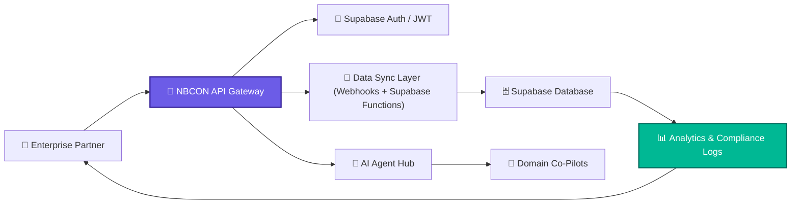

# 2.13 - 🤝 Enterprise Integration & Partnerships (Section 13)

---

## 🎯 Objective

Enable **enterprise-grade connectivity and collaboration** between NBCON PRO and external systems — integrating corporate tools, partner ecosystems, and enterprise clients through secure APIs, shared governance, and technical alignment.

This ensures NBCON functions not just as a platform, but as a **connective infrastructure layer** for engineering organizations across KSA and beyond.

---

## 🧩 1. Strategic Focus

Enterprise partnerships extend NBCON’s value through:

- **Systems Integration** — connecting NBCON PRO to corporate tools (ERP, BIM, CRM).
- **Service Partnerships** — collaborating with engineering firms, training providers, and data partners.
- **Compliance & Data Exchange** — secure information flow within regulated environments (e.g. Aramco, SABIC).
- **White-Label Enablement** — allowing large partners to operate NBCON-branded environments under their domain.

---

## ⚙️ 2. Integration Framework Overview

| Layer | Purpose | Description |
| --- | --- | --- |
| **API Layer** | Connect NBCON to external systems | REST + GraphQL endpoints authenticated via JWT |
| **Data Sync Layer** | Manage secure data transfer | Supabase functions + webhook subscriptions |
| **Partner SDK** | Allow developers to build integrations | JS/TS SDK with role-based permissions |
| **AI Collaboration Layer** | Embed AI Agents in partner systems | Domain-specific API wrappers (e.g. CivilGPT API) |
| **Governance Layer** | Control contracts & permissions | Enterprise Ops + PDPL-compliant audit logs |

---

## 🧠 3. Enterprise Integration Architecture

**Flow Summary:**

Enterprise systems connect via the API Gateway → authenticated through Supabase → data synchronized with audit-compliant webhooks.

AI Agents are embeddable through the AI Hub for white-label or co-branded integrations.

---

## 🧱 4. Partner Types & Roles

| Partner Type | Example | Integration Focus |
| --- | --- | --- |
| **Corporate Clients** | Aramco, SABIC, SEC | Enterprise dashboards, SSO, audit sync |
| **Engineering Firms** | SATECH, Saudi Comet | Project management + talent integration |
| **Training Providers** | NBCon Academy, Universities | AI-assisted course modules |
| **Technology Vendors** | Supabase, Stripe, Mapbox | Data, payment, and geospatial services |
| **Regulatory Partners** | MOMRAH, PDPL Board | Data compliance + certification |

---

## 🔐 5. Security & Compliance Controls

| Policy | Description | Enforcement |
| --- | --- | --- |
| **SSO / SAML 2.0** | Enterprise authentication for orgs | Enabled via Supabase Auth + SAML bridge |
| **Data Encryption** | AES-256 storage + HTTPS transfer | Enforced on all API endpoints |
| **Audit Logging** | Track partner API calls + data flow | Logged via `audit_logs` table |
| **Role-Based API Keys** | Scoped access for partners | Issued via Admin console |
| **PDPL Data Contracts** | Signed data-sharing agreements | Managed by Governance Board |

---

## 📈 6. Partnership Lifecycle

| Stage | Description | Output |
| --- | --- | --- |
| **P1 – Evaluation** | Assess partner alignment (tech + compliance) | Integration proposal |
| **P2 – Sandbox Setup** | Create test environment, limited data access | Partner workspace |
| **P3 – Integration Build** | Configure APIs, webhooks, AI agent endpoints | Technical integration |
| **P4 – Security Review** | Validate PDPL & SLA compliance | Signed compliance checklist |
| **P5 – Go-Live & Monitoring** | Deploy production connection | Active logs + alerts |
| **P6 – Renewal / Scaling** | Expand access, add tools or datasets | New contract cycle |

---

## 🤖 7. AI Agent Collaboration for Enterprise

| Integration | Description | Benefit |
| --- | --- | --- |
| **Embedded Agents** | Partner integrates CivilGPT, MechGPT, etc. | Domain AI directly in partner system |
| **Shared Training** | Federated learning with anonymized data | Continuous improvement across partners |
| **Co-Branded Dashboards** | NBCON x Partner portals with shared metrics | Visibility and joint analytics |
| **Custom AI Rulesets** | Organization-specific prompt libraries | Consistent tone and compliance |

---

## 🧩 8. Deliverables Checklist

✅ Enterprise API Gateway live

✅ Partner SDK (JS/TS) published

✅ Supabase integration templates ready

✅ Audit log + PDPL review complete

✅ Co-branded AI dashboard framework built

✅ Partner compliance review form in `/docs/enterprise/`

✅ White-label config JSON validated

---

## 🧭 9. Key Takeaway

Section 13 transforms NBCON from a standalone product into an **enterprise-grade ecosystem** —

where corporations, firms, and partners can securely integrate, collaborate, and scale their engineering intelligence.

It lays the foundation for **Section 14 – Stripe & Subscription Management System** and **Section 16 – Deployment Enforcement**, ensuring seamless payment and compliance continuity as enterprise adoption grows.

---