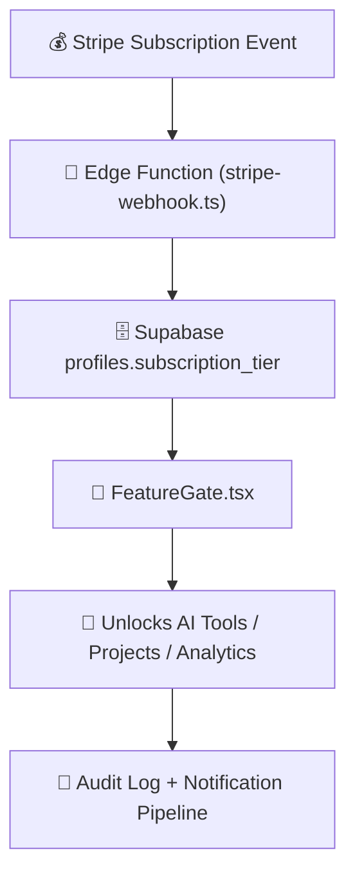

# 2.14 - 💵 Stripe & Subscription Management System (Section 14)

---

## 🎯 Objective

Integrate **Stripe** into NBCON PRO to enable seamless billing, subscription management, and automated tier enforcement across all product plans — Free, Basic, Pro, and Enterprise.

This ensures a unified experience where user entitlements, access tiers, and payments remain synchronized with Supabase and FeatureGate logic.

---

## 🧩 1. Integration Scope & Goals

| Goal | Description |
| --- | --- |
| **Subscription Sync** | Maintain one-to-one mapping between Stripe products ↔ NBCON tiers. |
| **Automated Billing** | Manage recurring payments, invoices, and renewals within the portal. |
| **Real-Time Entitlements** | Update Supabase profiles instantly on checkout, cancel, or upgrade. |
| **Feature Gating** | Enforce access to premium features via centralized FeatureGate logic. |
| **Audit & Compliance** | Log every transaction and webhook event for financial traceability. |

---

## ⚙️ 2. Architecture Overview

```mermaid
flowchart LR
  User["👤 User Action (Upgrade / Subscribe)"] --> Frontend["💻 Billing Portal / Stripe Checkout"]
  Frontend --> StripeAPI["💰 Stripe API / Checkout Session"]
  StripeAPI --> Webhook["🔔 Stripe Webhook (Edge Function)"]
  Webhook --> SupabaseDB["🗄️ Supabase Database – profiles / subscription_events"]
  SupabaseDB --> FeatureGate["🔐 FeatureGate / TierCheck"]
  FeatureGate --> App["🚀 NBCON App Modules (Dashboard / AI Tools / Agents)"]

  style StripeAPI fill:#6c5ce7,stroke:#341f97,stroke-width:2px,color:#fff
  style SupabaseDB fill:#00b894,stroke:#00695c,stroke-width:2px,color:#fff

```

**Flow Summary:**

Every user action (upgrade → checkout → webhook → profile update) feeds directly into Supabase → FeatureGate, ensuring **live tier enforcement** with no manual adjustments.

---

## 🧱 3. Stripe Objects Mapping

| Stripe Object | NBCON Entity | Description |
| --- | --- | --- |
| **Product** | Plan (Tier 0–3) | Free, Basic, Pro, Enterprise |
| **Price** | Subscription price (per month / year) | Defined in SAR |
| **Customer** | `profiles.id` | Linked via Stripe `customer_id` |
| **Subscription** | Active billing record | Determines current tier |
| **Invoice** | Financial record | Stored for audit |
| **Webhook Event** | `subscription_events` table | Captures create/update/cancel |

---

## 🔐 4. Environment Variables & Security

| Variable | Description |
| --- | --- |
| `STRIPE_PUBLIC_KEY` | Used in frontend checkout initialization |
| `STRIPE_SECRET_KEY` | Server-side API calls (Edge Functions) |
| `STRIPE_WEBHOOK_SECRET` | Validates incoming webhook requests |
| `NEXT_PUBLIC_STRIPE_PRICE_BASIC` | Price ID for Basic tier |
| `NEXT_PUBLIC_STRIPE_PRICE_PRO` | Price ID for Pro tier |
| `NEXT_PUBLIC_STRIPE_PRICE_ENTERPRISE` | Price ID for Enterprise tier |

---

## 🧩 5. Edge Functions (Backend Integration)

| Function | Purpose | Status |
| --- | --- | --- |
| **`checkout.ts`** | Creates Stripe Checkout Session and returns URL | ✅ Implemented |
| **`stripe-webhook.ts`** | Handles Stripe events (subscribe, renew, cancel) | ✅ Active |
| **`update-tier.ts`** | Syncs `profiles.subscription_tier` on event receipt | ✅ Connected |
| **`get-billing-portal.ts`** | Redirects user to Stripe billing portal | ✅ Functional |

---

## 🧠 6. Entitlement Enforcement Flow

**Key Rule:**

Stripe subscription tier → Supabase `profiles.subscription_tier` → FeatureGate determines feature visibility.

No manual role changes; all automated via payment state.

---

## 📊 7. Finance Dashboard & Audit Logs

| Metric | Description |
| --- | --- |
| **Active Subscriptions** | Total paid accounts by tier |
| **MRR (SAR)** | Monthly recurring revenue from Stripe |
| **Churn Rate %** | Percentage of users who cancelled in 30 days |
| **Failed Payments** | Logged for recovery workflow |
| **Revenue by Region** | Breakdown by KSA city / currency source |
| **Invoice History** | Linked to user ID and stored in Supabase |

All values are exposed via the internal Finance dashboard (`/admin/finance`) with export to CSV capability.

---

## 🧮 8. Testing & Validation Pipeline

| Test Case | Description | Tool |
| --- | --- | --- |
| **Checkout Flow** | Simulate subscription via test card 4242 4242 4242 4242 | Playwright |
| **Upgrade / Downgrade Sync** | Verify profile tier update on status change | Unit Tests |
| **Webhook Security** | Validate HMAC signature and error handling | Postman |
| **FeatureGate Access** | Ensure locked features react to tier update | E2E Tests |
| **Cancellation Flow** | Verify billing portal triggers revert to Free tier | Manual QA |

---

## 🧾 9. Deliverables Checklist

✅ Stripe account setup with pricing tiers

✅ Environment variables added to `.env` and docs

✅ Checkout + billing portal Edge Functions deployed

✅ Webhook handler logging to `subscription_events`

✅ FeatureGate integrated with `subscription_tier`

✅ QA sandbox tested with mock cards

✅ Financial report dashboard in Supabase

✅ Payment risk recorded in `RiskRegister.md`

✅ Rollout Runbook appendix added for Stripe validation

---

## 🧩 10. Key Takeaway

Section 14 cements NBCON PRO’s transition from prototype to **revenue-ready platform**.

All payment logic, tier mapping, and access control are **automated and observable**, ensuring predictable growth and enterprise-grade financial governance.

It directly supports **Section 15 – Portal Navigation & Tier Visibility** (UI integration) and **Section 16 – Testing & Deployment Enforcement** (final production controls).

---