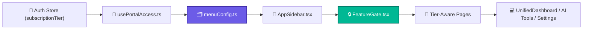
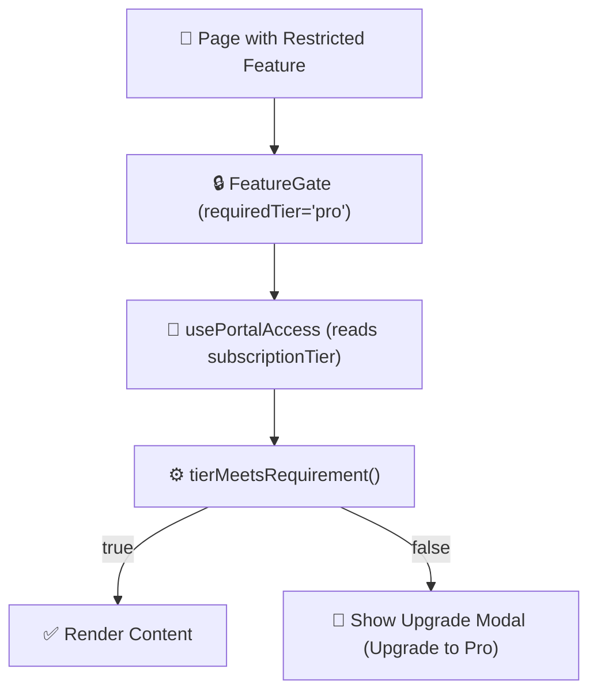

# 2.15 - 🧭 Portal Navigation & Tier Visibility (Section 15)

---

## 🎯 Objective

Implement a **dynamic, plan-based navigation system** that adjusts visible routes, menus, and features according to the user’s active subscription tier (Free → Basic → Pro → Enterprise).

This ensures a consistent UX across all roles while enforcing access rules automatically — no hardcoded “role” logic, only `plan`-driven visibility.

---

## 🧩 1. Core Principles

| Concept | Description |
| --- | --- |
| **Plan-Driven UI** | Every page, button, and tool declares a minimum required tier. |
| **Centralized Config** | Menu and visibility logic defined in `menuConfig.ts` and `portalRegistry.ts`. |
| **Real-Time Sync** | Supabase subscription changes instantly update visible routes. |
| **Upgrade UX** | Locked features display upgrade prompts, not errors. |
| **No Role Logic** | Legacy `role: 'client' |

---

## ⚙️ 2. Architecture Overview



**Flow Summary:**

When a user logs in, `subscriptionTier` → `usePortalAccess` → filters menus via `menuConfig.ts` → sidebar updates dynamically → FeatureGate enforces tier-level access on each page.

---

## 🧱 3. Core Files & Responsibilities

| File | Purpose | Notes |
| --- | --- | --- |
| **`src/config/menuConfig.ts`** | Defines all routes and their minimum tier requirement. | Base for sidebar generation. |
| **`src/config/portalRegistry.ts`** | Registry of all page metadata, including required features/tier. | Used by routing + analytics. |
| **`src/hooks/usePortalAccess.ts`** | Returns user plan info (`tier`, `limits`, `features`). | Connected to Supabase. |
| **`src/components/ui/FeatureGate.tsx`** | Wraps restricted content; shows upgrade prompts when needed. | Fully plan-aware. |
| **`src/components/layout/AppSidebar.tsx`** | Builds dynamic sidebar from menuConfig; filters locked items. | Supports icons, badges, tooltips. |
| **`src/pages/settings/Subscription.tsx`** | Shows current plan, upgrade options, and billing portal link. | Integrates with Stripe (Section 14). |

---

## 🧭 4. Tier-Based Navigation Logic

| Plan | Sidebar Visibility | Upgrade Prompts |
| --- | --- | --- |
| **Free** | Core pages only (Dashboard, Browse, Messages, Learning). | Locked items show “Pro required” modal. |
| **Basic** | Adds multi-project + advanced reporting routes. | Sees “Pro features” as preview with badge. |
| **Pro** | Unlocks all AI tools, analytics, integrations. | Only Enterprise Ops remain locked. |
| **Enterprise** | Full visibility; SSO + Admin Ops + BI enabled. | No upgrade prompts shown. |

---

## 🧠 5. Dynamic Menu Structure Example

```tsx
// menuConfig.ts
export const menuConfig = [
  { label: 'Overview', icon: LayoutDashboard, route: '/overview', plan: 'free' },
  { label: 'Dashboard', icon: PresentationChartBar, route: '/dashboard', plan: 'free' },
  { label: 'AI Tools', icon: CpuChip, route: '/ai-tools', plan: 'pro' },
  { label: 'Finance', icon: Banknotes, route: '/finance', plan: 'pro' },
  { label: 'Enterprise Ops', icon: BuildingOffice2, route: '/enterprise', plan: 'enterprise' },
];

```

🧩 **Usage Example**

```tsx
{menuConfig
  .filter(item => tierMeetsRequirement(userTier, item.plan))
  .map(item => <SidebarLink key={item.route} {...item} />)}

```

---

## 🧩 6. FeatureGate Enforcement Flow



---

## 🧮 7. Tier Badge System

| Plan | Badge | Color | Placement |
| --- | --- | --- | --- |
| Free | 🟢 “Free Plan” | Neutral gray | Dashboard top bar |
| Basic | 🔵 “Basic Plan” | Blue-500 | Dashboard + Settings |
| Pro | 🟣 “Pro Plan” | Purple-500 | Dashboard + Toolbar |
| Enterprise | 🟡 “Enterprise” | Gold | Admin header |

Badges are loaded dynamically from the subscription object to reinforce awareness and upgrade paths.

---

## 🧾 8. Deliverables Checklist

✅ `menuConfig.ts` + `portalRegistry.ts` unified

✅ Dynamic sidebar and menu filtering by tier

✅ FeatureGate component fully operational

✅ Tier badges visible on all dashboards

✅ Upgrade modal and inline CTA integrated

✅ Tier check tests added to E2E suite

✅ `/subscription` page synced with Stripe Portal (Section 14)

✅ All legacy role checks removed from codebase

✅ Verified that `tierMeetsRequirement()` logic matches Stripe mappings

---

## 🧩 9. Key Takeaway

Section 15 finalizes **UI-tier enforcement** — making the NBCON experience self-regulating.

Users see exactly what their plan allows, upgrades are guided rather than blocked, and the system remains visually consistent, predictable, and fully automated from Stripe to Sidebar.

---