# 2.16 - 🔒Testing & Deployment Enforcement (Section 16)

---

## 🎯 Objective

Guarantee **end-to-end system stability and compliance** across all environments — from development to production — by enforcing automated testing, CI/CD validation, and deployment gating.

This section ensures every commit, build, and release adheres to NBCON’s **quality, security, and tier-enforcement standards**.

---

## 🧩 1. Core Principles

| Principle | Description |
| --- | --- |
| **Zero-Regression Policy** | No feature deploys without passing all automated checks. |
| **Tier Enforcement Validation** | Subscription and FeatureGate behavior tested on every pipeline. |
| **Automated Deployment** | GitHub Actions + Supabase migrations + Stripe sync handled automatically. |
| **Config Immutability** | `.env`, `RLS policies`, and `FeatureGate` configs protected via schema validation. |
| **Governance Compliance** | PDPL, financial, and audit requirements validated pre-deploy. |

---

## ⚙️ 2. Deployment Architecture

```mermaid
flowchart LR
  Dev["👩‍💻 Developer Commit (pnpm push)"] --> CI["⚙️ GitHub Actions (CI/CD)"]
  CI --> Tests["🧪 Lint • Typecheck • Unit • E2E"]
  Tests --> Deploy["🚀 Supabase + Vercel Deploy"]
  Deploy --> Migrations["🗄️ Database Migration + Stripe Sync"]
  Migrations --> Monitors["📊 Post-Deploy Validation (Playwright + Logs)"]
  Monitors --> Alerts["🔔 Slack Alerts + Rollback Hook"]

  style CI fill:#6c5ce7,stroke:#341f97,stroke-width:2px,color:#fff
  style Deploy fill:#00b894,stroke:#00695c,stroke-width:2px,color:#fff
  style Monitors fill:#fdcb6e,stroke:#b8860b,stroke-width:2px,color:#fff

```

**Flow Summary:**

Every code change passes through CI pipelines → automated tests → deployment → live monitoring and rollback.

Stripe, Supabase, and FeatureGate synchronization are validated post-deploy before a version tag is finalized.

---

## 🧱 3. CI/CD Workflows

| Workflow | Trigger | Actions | Enforcement |
| --- | --- | --- | --- |
| **`ci.yml`** | On pull request | Lint, Typecheck, Unit Tests | Blocks merge if failed |
| **`e2e.yml`** | Nightly | Playwright E2E across all tiers | Logs report in `/reports/` |
| **`release.yml`** | On tag (vX.Y.Z) | Build, deploy to staging → production | Auto-version bump |
| **`migrations.yml`** | On DB schema change | Run Supabase migration validation | Rejects unsafe schema changes |
| **`stripe-sync.yml`** | On webhook push | Validate product/tier parity | Warns if mismatch |
| **`monitor.yml`** | Hourly cron | Ping uptime + alert failures | Auto rollback trigger |

---

## 🧠 4. Testing Hierarchy

| Level | Tool | Purpose |
| --- | --- | --- |
| **Unit Tests** | Vitest | Validate functions (`tierMeetsRequirement()`, FeatureGate logic) |
| **Integration Tests** | Jest / Supabase Mock | Ensure modules (Auth ↔ FeatureGate ↔ Stripe) interact correctly |
| **E2E Tests** | Playwright | Simulate full user flow per subscription tier |
| **Regression Tests** | Snapshot | Compare layout/UI diffs post-release |
| **Security Tests** | ZAP CLI | Check public endpoints + policies |
| **Performance Tests** | k6 / Lighthouse | Measure latency and response under load |

---

## 🧩 5. Tier-Validation Matrix (E2E Coverage)

| Test Case | Free | Basic | Pro | Enterprise |
| --- | --- | --- | --- | --- |
| Dashboard Access | ✅ | ✅ | ✅ | ✅ |
| AI Tools (Project Planning) | ✅ | ✅ | ✅ | ✅ |
| Advanced Analytics | 🔒 | ✅ | ✅ | ✅ |
| Specialized Agents | 🔒 | 🔒 | ✅ | ✅ |
| Enterprise Ops | 🔒 | 🔒 | 🔒 | ✅ |
| Billing Portal | ✅ | ✅ | ✅ | ✅ |
| Upgrade Flow | ✅ | ✅ | ✅ | N/A |

These tests run nightly via Playwright using mock subscriptions fetched from Supabase sandbox.

---

## 🔐 6. Deployment Verification Pipeline

```mermaid
flowchart TB
  Deploy["🚀 Deploy to Staging"]
  Deploy --> Migrate["🗄️ Run Supabase Migrations"]
  Migrate --> SyncStripe["💰 Sync Stripe Products/Plans"]
  SyncStripe --> VerifyTests["🧪 Run Tier E2E + Webhook Tests"]
  VerifyTests --> Tag["🏷️ Tag Release (vX.Y.Z)"]
  Tag --> Promote["⬆️ Promote to Production"]
  Promote --> Monitor["📈 Post-Deploy Validation (Uptime + Logs)"]
  Monitor --> Rollback["🔁 Auto-Rollback if Failure"]

  style SyncStripe fill:#6c5ce7,stroke:#341f97,stroke-width:2px,color:#fff
  style VerifyTests fill:#0984e3,stroke:#0652DD,stroke-width:2px,color:#fff
  style Monitor fill:#00b894,stroke:#00695c,stroke-width:2px,color:#fff

```

---

## 🧾 7. Deliverables Checklist

✅ CI/CD workflows (`ci.yml`, `release.yml`, `e2e.yml`) committed

✅ Tier-aware Playwright suite (`tests/e2e/tiers.spec.ts`)

✅ Stripe + Supabase sync test (`tests/integration/stripeSync.spec.ts`)

✅ PDPL compliance check script integrated

✅ Automated rollback pipeline configured

✅ Governance logs exported to `/docs/audit/`

✅ Nightly job publishes system health to Notion dashboard

✅ Alerts wired to Slack channel `#nbcon-deploy`

---

## 🧮 8. Validation Metrics

| Metric | Target | Description |
| --- | --- | --- |
| **E2E Pass Rate** | ≥ 95 % | Across all subscription tiers |
| **Deployment Time** | < 4 min avg | CI/CD full cycle duration |
| **Rollback MTTR** | < 3 min | Mean time to recovery post-fail |
| **Downtime** | < 0.1 % | 99.9 % uptime objective |
| **Stripe Sync Drift** | 0 % | No mismatch between Stripe & Supabase |

---

## 🧩 9. Governance & Enforcement Hooks

| Check | Description | Frequency |
| --- | --- | --- |
| **PDPL Compliance Script** | Validates data retention + encryption | On deploy |
| **RiskRegister Update** | Auto-updates after deployment | Weekly |
| **Release Notes Generation** | Markdown + Notion export | Every release |
| **Owner Sign-off Enforcement** | Require approvals in `OWNERS.md` | On PR |
| **Security Alerts** | GitHub Dependabot + ZAP | Continuous |

---

## 🧭 10. Key Takeaway

Section 16 ensures NBCON PRO is **bulletproof under continuous change**.

Every feature — from AI Agents to Stripe billing — is protected by automated validation, governance, and rollback discipline.

With CI/CD, E2E, and compliance loops in place, the platform is **ready for production-grade scaling and enterprise adoption**.

---