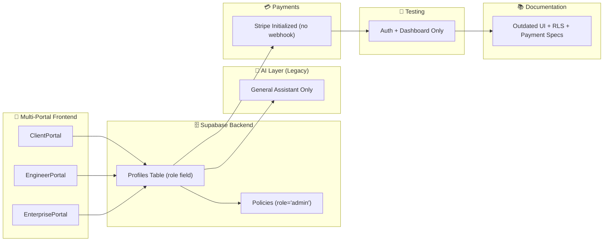
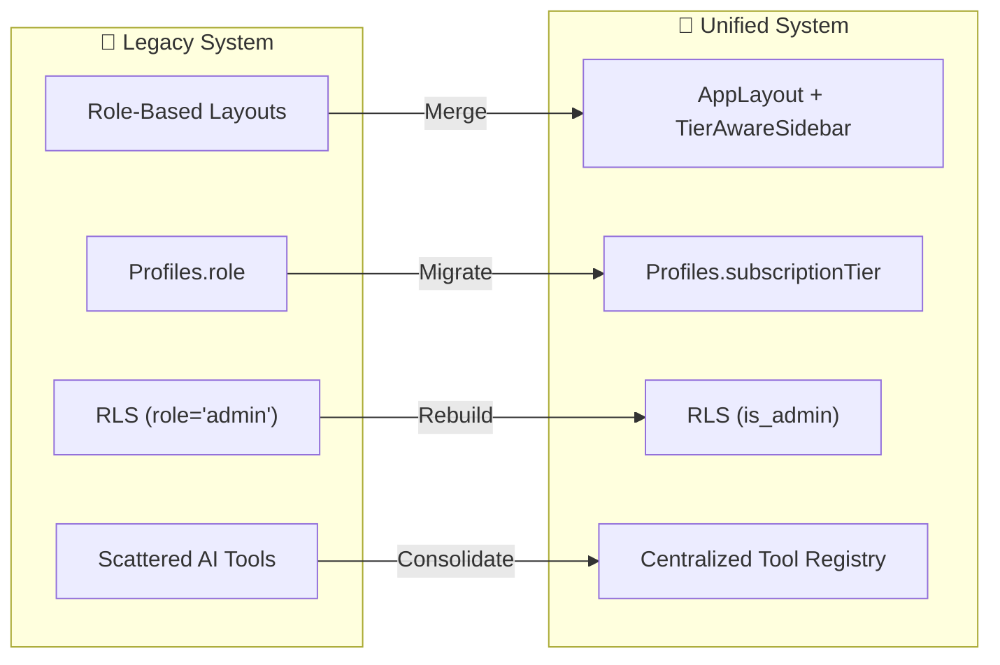

# 2.2- 🗿 Current State Recap (Section 2)

---

## **Context**

This section captures the **state of the monorepo, data model, and UI before unification.**

It identifies the technical debt, inconsistencies, and blockers that must be resolved before implementing unified tier gating and subscription enforcement.

---

## 🧱 **Current Environment Overview**

| Layer | Current State | Notes |
| --- | --- | --- |
| **Frontend (Web)** | Multiple portal-specific layouts (`ClientPortal`, `EngineerPortal`, `EnterprisePortal`) | Role-based forked architecture → needs consolidation under `AppLayout` |
| **Backend (Supabase)** | `profiles` table still includes `role` column | RLS and logic depend on this — migration required |
| **AI Layer** | Partially centralized; general assistant only | Specialized agents defined but not linked to `subscriptionTier` |
| **Payments** | Stripe account initialized but not integrated | No webhooks or tier mapping yet |
| **Testing** | Partial E2E coverage (only authentication & dashboard) | Feature gating not tested |
| **Docs** | Incomplete or outdated | Missing UI specs, RLS guide, payment flow diagrams |

---

## 🚧 **Technical Debt Summary**

| Category | Issue | Impact | Priority | Action |
| --- | --- | --- | --- | --- |
| **UI** | 3 separate layouts | High | 🔴 | Merge into single AppLayout |
| **Access Control** | Legacy `role` logic | High | 🔴 | Replace with `subscriptionTier` + `is_admin` |
| **RLS Policies** | Use `role='admin'` conditions | Critical | 🔴 | Rebuild RLS with `is_admin` boolean |
| **AI Tools Registry** | Tools scattered per portal | Medium | 🟠 | Centralize under `/src/ai/toolRegistry.ts` |
| **Testing Gaps** | Missing tests for FeatureGate & Subscription | High | 🔴 | Add unit + e2e |
| **Stripe Integration** | No webhook mapping | High | 🔴 | Implement `/api/stripe/webhook` handler |
| **Docs** | Outdated or fragmented | Medium | 🟡 | Consolidate under `/docs/` |

---

## ⚙️ **Current Monorepo Architecture**

```bash
apps/
  ├── web/
  │   ├── src/pages/
  │   │   ├── client/
  │   │   ├── engineer/
  │   │   ├── enterprise/
  │   │   ├── shared/
  │   │   └── _layout/
  │   └── components/
  └── mobile/ (incomplete)
packages/
  ├── ui/
  ├── shared/
  ├── utils/
  └── ai/
supabase/
  ├── migrations/
  ├── policies/
  └── seed.sql

```

🔹 **Problem:** Layout and access logic duplicated across 3 folders.

🔹 **Fix Target:** All pages unified under `src/pages/portal/` with a single layout and FeatureGate.

---

## 🧭 **Legacy Architecture Diagram**



---

## 🧩 **Key Observations (from Audit)**

- ~42 files still contain `role: 'client' | 'engineer' | 'enterprise'`.
- 6 RLS policies tied to `role='admin'`.
- Stripe keys missing from `.env`; actions stubbed.
- FeatureGate unused in production routes.
- CoPilotToolbar implemented but commented out.

---

## 🧪 **Validation & Testing Status**

| Area | Current Coverage | Issue |
| --- | --- | --- |
| Authentication | ✅ 100% | Complete |
| Dashboard | 🟢 70% | Missing tier-based gating |
| Payments | 🔴 0% | Not implemented |
| AI Tools | 🟠 50% | Partial coverage |
| Database (RLS) | 🟠 60% | Needs revalidation |
| End-to-End | 🟠 Partial | Missing tier scenarios |

---

## 🧰 **Audit Commands**

```bash
# Find role-based code
rg "role: 'client'" src/
rg "role: 'engineer'" src/
rg "role: 'enterprise'" src/

# Find role usage in RLS
rg "role='admin'" supabase/policies/

# Verify Stripe integration
rg "stripe" src/

# Run tests
pnpm test
pnpm exec playwright test

```

---

## 📘 **Documentation Debt**

| Doc | Status | Next Step |
| --- | --- | --- |
| `UI_SPEC.md` | Outdated | Replace with unified dashboard doc |
| `RLS_GUIDE.md` | Incomplete | Add new `is_admin` migration |
| `PAYMENTS_SPEC.md` | Missing | Create in Section 14 |
| `AGENT_PLAYBOOKS.md` | Partial | Expand in Section 8 |
| `TEST_MATRIX.md` | Outdated | Update post-Phase D |

---

## 🔄 **Current → Target System Transition Diagram**



---

## ✅ **Section 2 Checklist**

| Task | Owner | Status | Notes |
| --- | --- | --- | --- |
| Audit codebase for role refs | Backend | ☐ | `rg "role:"` and `role='admin'` |
| Summarize active policies | DBA | ☐ | Prepare migration scripts |
| Inventory portal layouts | Frontend | ☐ | Confirm duplication count |
| Document missing tests | QA | ☐ | Map against Section 6 scope |
| Centralize AI tool registry | AI Team | ☐ | Prepare `/src/ai/toolRegistry.ts` |
| Collect env keys (Stripe, Supabase) | DevOps | ☐ | Add `.env.example` |
| Draft `Current_State_Summary.md` | Product Ops | ☐ | Upload before Section 3 kickoff |

---

## 🔗 **Dependencies**

- Feeds **Section 3 (UI Unification)** — remove layout duplication.
- Feeds **Section 5 (RLS Cleanup)** — rebuild policies.
- Feeds **Section 14 (Stripe)** — prepare webhook + envs.

---

## 🧠 **Key Takeaway**

NBCON currently operates as **three isolated portals** using **role-based logic**.

Before unification, all role dependencies and RLS conditions must be replaced with **subscription-tier logic** to enable coherent access control and AI-driven workflows.

---