# 2.3- 🧠 Phase A: UI Unification (Section 3)

---

## **Context**

The platform currently runs **three isolated portal layouts** (Client / Engineer / Enterprise).

Phase A consolidates them into a **single unified interface** — powered by `AppLayout`, `TierAwareSidebar`, and `UnifiedDashboard`.

Feature visibility is now determined **entirely by `subscriptionTier` + `FeatureGate`**, never by legacy `role` logic.

---

## 🧩 **Objectives**

- **Single layout architecture:** Replace `ClientPortal`, `EngineerPortal`, and `EnterprisePortal` with one `AppLayout`.
- **Unified navigation:** Sidebar dynamically driven by `plan` (`free`, `basic`, `pro`, `enterprise`).
- **Reusable dashboard:** One configurable `UnifiedDashboard.tsx` shared across all tiers.
- **Theming consistency:** Light/dark/system via Tailwind tokens and persistent preferences.
- **Feature gating:** `<FeatureGate>` enforces tier logic for routes and UI sections.

---

## ⚙️ **Deliverables**

| Deliverable | Description |
| --- | --- |
| `AppLayout.tsx` | Base container: header + sidebar + content + toolbar slot |
| `TierAwareSidebar.tsx` | Renders menu dynamically based on user tier |
| `UnifiedDashboard.tsx` | Central dashboard template for all plans |
| `FeatureGate.tsx` | Wrapper that checks user plan & displays upgrade CTA |
| `CoPilotToolbar.tsx` | Persistent floating toolbar for AI tools (Chat / Docs / Agents) |

---

## 🧭 **Unified UI Flow Diagram**

```mermaid
flowchart LR
  subgraph User["👤 User Interaction"]
    A1["User clicks / navigates"]
  end

  subgraph Layout["🧱 Unified Layout System"]
    B1["AppLayout.tsx"]
    B2["TierAwareSidebar.tsx"]
    B3["UnifiedDashboard.tsx"]
    B4["FeatureGate.tsx"]
    B5["CoPilotToolbar.tsx"]
  end

  subgraph Logic["⚙️ Access & Plan Logic"]
    C1["usePortalAccess()"]
    C2["tierMeetsRequirement()"]
    C3["subscriptionTier context"]
  end

  subgraph API["🗄️ Backend / Data"]
    D1["Supabase Auth + Profiles"]
    D2["RLS (is_admin + plan gating)"]
    D3["Stripe Webhook → subscriptionTier"]
  end

  A1 --> B1
  B1 --> B2
  B2 -->|Filtered Menu| B3
  B3 --> B4
  B4 -->|Check Plan| C2
  C2 -->|Fetch Tier| C1
  C1 --> D1
  D1 --> D2
  D2 --> D3
  B5 -->|AI Actions| D1

```



---

## 🧱 **Implementation Plan**

| Step | Component | Status | Notes |
| --- | --- | --- | --- |
| 1 | `AppLayout.tsx` | ☐ | Header, sidebar, theme toggle |
| 2 | `TierAwareSidebar.tsx` | ☐ | Reads menu from `menuConfig.ts` |
| 3 | `UnifiedDashboard.tsx` | ☐ | Widgets + quick actions |
| 4 | `FeatureGate.tsx` | ☐ | Checks `subscriptionTier` |
| 5 | `CoPilotToolbar.tsx` | ☐ | Hover-triggered shortcuts |
| 6 | Remove legacy portals | ☐ | Redirect to `/portal` |
| 7 | `AppRouter.tsx` tier routing | ☐ | `/dashboard`, `/projects`, `/finance`, `/settings` |
| 8 | Theme provider setup | ☐ | Tailwind + `prefers-color-scheme` |
| 9 | Remove `role` guards | ☐ | Delete all role-based checks |

---

## 🧭 **Navigation Logic Spec**

```tsx
// menuConfig.ts
export const menuConfig = [
  { label: "Overview", icon: LayoutDashboard, route: "/overview", plan: "free" },
  { label: "Projects", icon: Folder, route: "/projects", plan: "free" },
  { label: "Finance", icon: Banknotes, route: "/finance", plan: "pro" },
  { label: "Enterprise Ops", icon: UsersCog, route: "/enterprise", plan: "enterprise" },
];

// usage
const { subscriptionTier } = usePortalAccess();
menuConfig.filter(item => tierMeetsRequirement(subscriptionTier, item.plan));

```

---

## 🧠 **Design Rules**

| Rule | Description |
| --- | --- |
| One source of truth | Menus defined in `menuConfig.ts` only |
| Plan-driven visibility | Controlled exclusively by `tierMeetsRequirement()` |
| No role forks | `role` removed entirely from UI logic |
| Consistent toolbar | `CoPilotToolbar` visible on all routes |
| Responsive layout | Mobile parity ensured with Tailwind breakpoints |

---

## 💡 **UI Interaction Diagram**

```mermaid
flowchart TD
  User["👤 User Action"]
  Sidebar["🧭 TierAwareSidebar"]
  FeatureGate["🔒 FeatureGate Check"]
  Upgrade["⚡ Upgrade Prompt"]
  Dashboard["📊 UnifiedDashboard"]
  Toolbar["🤖 CoPilotToolbar"]

  User --> Sidebar
  Sidebar --> FeatureGate
  FeatureGate -->|Unlocked| Dashboard
  FeatureGate -->|Locked| Upgrade
  Dashboard --> Toolbar
  Toolbar --> User

```



---

## 🧪 **Component-Level Testing**

| Component | Test Type | Coverage | Notes |
| --- | --- | --- | --- |
| AppLayout | Snapshot + a11y | 100% | Header/sidebar/toolbar presence |
| TierAwareSidebar | Unit + logic | 100% | Verify filtering by plan |
| UnifiedDashboard | Snapshot + props | 100% | Layout composition |
| FeatureGate | Unit + e2e | 100% | Correct gating + upgrade flow |
| CoPilotToolbar | E2E hover | 90% | Validate actions + icons |

---

## ✅ **Section 3 Checklist**

| Task | Owner | Status | Notes |
| --- | --- | --- | --- |
| Finalize UI spec (Figma/MD) | Product/UI | ☐ | Stored in `/docs/ui-ux/` |
| Implement AppLayout | Frontend | ☐ | Unified base layout |
| Implement TierAwareSidebar | Frontend | ☐ | Plan-based filtering |
| Connect UnifiedDashboard | Frontend | ☐ | Replace old dashboards |
| Integrate FeatureGate | Frontend/Backend | ☐ | Sync with `subscriptionTier` |
| Mount CoPilotToolbar | Frontend | ☐ | Global AI shortcuts |
| Delete legacy layouts | Frontend | ☐ | Remove obsolete portals |
| Verify CI build | DevOps | ☐ | All jobs green |
| Document final UI spec | Docs | ☐ | Add layout + menu maps |

---

## 🔗 **Dependencies**

- **From Section 2:** Role audit and layout inventory.
- **Feeds Section 4:** Access & data model.
- **Feeds Section 15:** Tier visibility logic.
- **Feeds Section 16:** CI + visual testing.

---

## ⚠️ **Risks & Mitigation**

| Risk | Impact | Mitigation |
| --- | --- | --- |
| CSS regressions | Medium | Visual snapshot diff before merge |
| Route collisions | Low | Namespace under `/portal/*` |
| Toolbar load timing | Low | Lazy-load post-hydration |

---

## 📚 **Artifacts**

- `/docs/ui-ux/CoPilot_UI_Spec.md` – final layout doc
- `/docs/ui-ux/Menu_Registry.md` – plan ↔ route mapping
- `/docs/ui-ux/FeatureGate_Usage.md` – gating implementation guide

---

---