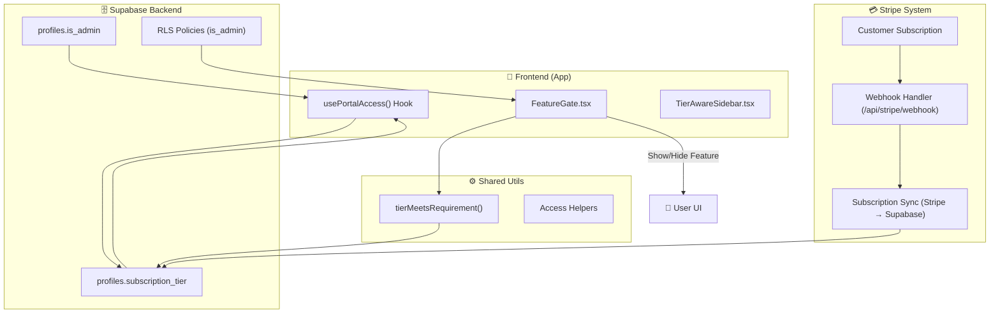

# 2.4- 🔐 Phase B: Access & Data Model (Section 4)

---

## **Context**

NBCON’s legacy **role-based access model** (`client`, `engineer`, `enterprise`) is deprecated.

Phase B establishes a **plan-driven access model** centered on `subscriptionTier` and `is_admin`.

This unifies frontend and backend logic — every access decision, from RLS to FeatureGate, follows a single tier-driven standard.

---

## 🎯 **Objectives**

- **Deprecate roles:** Drop `profiles.role` from schema and code.
- **Centralize access logic:** Everything uses `subscriptionTier` and `is_admin`.
- **Rebuild RLS:** All policies rely on `is_admin`.
- **Link Stripe ↔ Supabase:** Tier updates flow automatically.
- **Expose helpers:** `usePortalAccess()` + `tierMeetsRequirement()` unify frontend checks.

---

## 🧩 **Deliverables**

| Deliverable | Description |
| --- | --- |
| `profiles` schema migration | Removes `role`; adds `subscription_tier`, `is_admin` |
| RLS rewrite | All policies migrated to use `is_admin` boolean |
| Access hooks | `usePortalAccess()` returns `{ tier, isAdmin, subscriptionStatus }` |
| Tier utilities | `tierMeetsRequirement()` helper shared across frontend |
| Subscription sync | Stripe → Supabase → Frontend flow validated |

---

## ⚙️ **Implementation Plan**

| Step | Module | Status | Notes |
| --- | --- | --- | --- |
| 1 | `supabase/migrations/2025_add_tier_is_admin.sql` | ☐ | Adds `subscription_tier`, `is_admin` |
| 2 | Migration script | ☐ | Map legacy roles to tiers |
| 3 | `supabase/policies/*.sql` | ☐ | Replace `role='admin'` with `is_admin` |
| 4 | `tierUtils.ts` | ☐ | Compare tiers by hierarchy |
| 5 | `usePortalAccess.ts` | ☐ | Hook for tier/admin state |
| 6 | Global find-replace | ☐ | Remove all `role` conditions |
| 7 | `FeatureGate.tsx` | ☐ | Enforce tier gating |
| 8 | `stripe/sync.ts` | ☐ | Map price IDs → tiers |
| 9 | `pnpm exec supabase gen types` | ☐ | Regenerate TS types |

---

## 🧱 **New Data Model**

```sql
CREATE TABLE profiles (
  id UUID PRIMARY KEY,
  full_name TEXT,
  email TEXT UNIQUE,
  subscription_tier TEXT DEFAULT 'free' CHECK (subscription_tier IN ('free','basic','pro','enterprise')),
  is_admin BOOLEAN DEFAULT FALSE,
  stripe_customer_id TEXT,
  created_at TIMESTAMP DEFAULT now()
);

```

---

## 🔐 **Access & Sync Flow Diagram**



---

## 🧩 **Access Control Flow**

```
Frontend → usePortalAccess()
             ↓
subscriptionTier ← Supabase.profiles.subscription_tier
isAdmin ← Supabase.profiles.is_admin
             ↓
FeatureGate / Sidebar / Routes
             ↓
Tier restriction + upgrade CTA

```

Backend (RLS):

```sql
CREATE POLICY "users_read_own_data"
ON profiles
FOR SELECT
USING (auth.uid() = id OR is_admin);

```

---

## 🧠 **Utility Example**

```tsx
// tierUtils.ts
const TIER_HIERARCHY = ['free', 'basic', 'pro', 'enterprise'];

export function tierMeetsRequirement(userTier: string, requiredTier: string) {
  return TIER_HIERARCHY.indexOf(userTier) >= TIER_HIERARCHY.indexOf(requiredTier);
}

```

---

## 🧪 **Acceptance Tests**

| Test | Target | Expectation |
| --- | --- | --- |
| AC-1 | `profiles.role` column removed | No residual DB column |
| AC-2 | `is_admin` policy check | Admin access only |
| AC-3 | Non-admin restricted | Access denied |
| AC-4 | FeatureGate on free plan | Shows upgrade prompt |
| AC-5 | Stripe webhook sync | Updates `subscription_tier` instantly |
| AC-6 | `usePortalAccess()` values | Match Supabase data |

---

## ✅ **Section 4 Checklist**

| Task | Owner | Status | Notes |
| --- | --- | --- | --- |
| SQL migration created | DBA | ☐ | Includes data migration |
| Supabase types updated | DevOps | ☐ | TS schema aligned |
| `tierUtils.ts` implemented | Backend | ☐ | Hierarchy logic complete |
| `usePortalAccess.ts` done | Frontend | ☐ | Fetch + context integration |
| Role refs replaced | Full stack | ☐ | Grep + codemod |
| FeatureGate updated | Frontend | ☐ | Uses new hook |
| Stripe mapping added | Backend | ☐ | Map price IDs |
| RLS verified | QA | ☐ | Audit via `pg_policies` |
| Unit tests for helpers | QA | ☐ | Full coverage |
| Migration documented | Docs | ☐ | `/docs/rls-guide/` updated |

---

## 🔗 **Dependencies**

- **From:** Section 3 (Unified UI).
- **Feeds:**
    - Section 5 (RLS Cleanup).
    - Section 14 (Stripe).
    - Section 15 (Tier Visibility).

---

## ⚠️ **Risks & Mitigation**

| Risk | Impact | Mitigation |
| --- | --- | --- |
| Missed role refs | High | Add grep scan in CI |
| Wrong Stripe sync | Medium | Idempotent webhook + retry |
| RLS lockout | High | Test `is_admin` override |
| Stale Supabase types | Medium | Auto-generate in CI |

---

## 📚 **Artifacts**

- `/docs/rls-guide/RLS_Migration_Spec.md` – SQL scripts + rollback plan
- `/docs/access/Access_Model_Ref.md` – architecture diagram + flow
- `/docs/shared/Tier_Utils_Reference.md` – helper documentation
- `/docs/testing/Access_Tests.md` – E2E + unit test coverage matrix

---