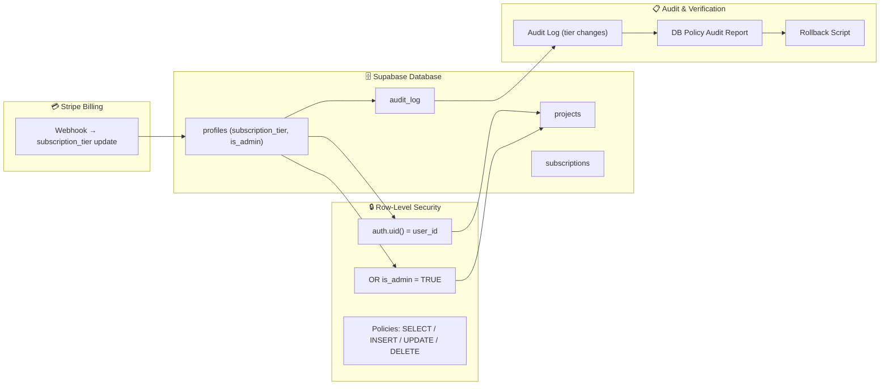

# 2.5-🗄️Phase C: Database & RLS Cleanup (Section 5)

---

## **Context**

With `subscription_tier` and `is_admin` now live from **Section 4**, this phase focuses on **deep-cleaning Supabase** to eliminate all legacy role-based artifacts, finalize RLS enforcement, and ensure airtight database integrity.

The goal: a **fully tier-driven, role-agnostic** schema that’s ready for production and Stripe synchronization.

---

## 🎯 **Objectives**

- **Remove all role remnants** — drop `profiles.role` and any related triggers or functions.
- **Standardize RLS** — enforce access with `is_admin` + `auth.uid()`.
- **Verify policy coverage** across all user-accessible tables.
- **Add audit trail** for tier or privilege changes.
- **Snapshot + rollback** — finalize schema under a versioned Supabase tag.

---

## 🧩 **Deliverables**

| Deliverable | Description |
| --- | --- |
| `drop_role.sql` | Removes legacy column + triggers |
| `update_rls_is_admin.sql` | Rewrites all policies for `is_admin` |
| `policy_audit_report.md` | Confirms full RLS coverage |
| `seed.sql` update | Adds tier definitions |
| `rollback_20250301000001.sql` | Full rollback for safety |
| Supabase tag `v2.0.2-db` | Locked baseline after QA verification |

---

## ⚙️ **Implementation Plan**

| Step | Script / File | Status | Notes |
| --- | --- | --- | --- |
| 1 | `20250301000001_drop_role.sql` | ☐ | Drop `profiles.role` after verification |
| 2 | `20250301000002_update_rls_is_admin.sql` | ☐ | `USING (auth.uid() = user_id OR is_admin)` |
| 3 | Policy audit | ☐ | Verify no unprotected tables |
| 4 | Subscription mapping FK | ☐ | Link `subscriptions.user_id → profiles.id` |
| 5 | Audit triggers | ☐ | Log tier + admin changes |
| 6 | Rollback script | ☐ | Restore previous state if needed |
| 7 | Update `seed.sql` | ☐ | Seed default tiers |
| 8 | Type generation | ☐ | `pnpm exec supabase gen types` |
| 9 | Tag DB | ☐ | `v2.0.2-db` after validation |

---

## 🧱 **SQL Example Snippets**

### Drop Legacy Role Column

```sql
ALTER TABLE profiles
DROP COLUMN IF EXISTS role;

```

---

### Rewrite RLS Example

```sql
CREATE POLICY "users_can_read_own_projects"
ON projects
FOR SELECT
USING (auth.uid() = owner_id OR is_admin);

CREATE POLICY "users_can_insert_own_projects"
ON projects
FOR INSERT
WITH CHECK (auth.uid() = owner_id OR is_admin);

```

---

### Add Audit Logging

```sql
CREATE TABLE audit_log (
  id SERIAL PRIMARY KEY,
  user_id UUID,
  event TEXT,
  old_tier TEXT,
  new_tier TEXT,
  changed_at TIMESTAMP DEFAULT now()
);

CREATE OR REPLACE FUNCTION log_tier_change()
RETURNS TRIGGER AS $$
BEGIN
  IF NEW.subscription_tier <> OLD.subscription_tier THEN
    INSERT INTO audit_log (user_id, event, old_tier, new_tier)
    VALUES (NEW.id, 'tier_changed', OLD.subscription_tier, NEW.subscription_tier);
  END IF;
  RETURN NEW;
END;
$$ LANGUAGE plpgsql;

CREATE TRIGGER tier_change_audit
AFTER UPDATE ON profiles
FOR EACH ROW EXECUTE FUNCTION log_tier_change();

```

---

## 🧭 **Unified DB & RLS Architecture Diagram**



---

## 🔍 **Policy Coverage Matrix**

| Table | SELECT | INSERT | UPDATE | DELETE | RLS Active | Notes |
| --- | --- | --- | --- | --- | --- | --- |
| `profiles` | ✅ | ❌ | ✅ | ❌ | ✅ | Own record + admin |
| `projects` | ✅ | ✅ | ✅ | ✅ | ✅ | Owner or admin only |
| `subscriptions` | ✅ | ✅ | ✅ | ❌ | ✅ | System-managed |
| `messages` | ✅ | ✅ | ✅ | ✅ | ✅ | Conversation participants |
| `audit_log` | ✅ | ❌ | ❌ | ❌ | ✅ | Admin read-only |

---

## 🧪 **Validation Commands**

```bash
# Verify all role references removed
rg "role=" supabase/policies/

# List active policies
supabase db list policies

# Schema diff for drift
supabase db diff --linked --local

# Regenerate Supabase types
pnpm exec supabase gen types typescript --local > src/types/supabase.ts

```

---

## ✅ **Section 5 Checklist**

| Task | Owner | Status | Notes |
| --- | --- | --- | --- |
| Drop `profiles.role` | DBA | ☐ | After migration verification |
| Rebuild RLS | DBA | ☐ | `is_admin` based |
| Policy coverage audit | Security | ☐ | Every table secured |
| Implement audit log | Backend | ☐ | Log tier/admin changes |
| Seed base tiers | DevOps | ☐ | Free / Basic / Pro / Enterprise |
| Validate Stripe sync | Backend | ☐ | Subscription updates propagate |
| Supabase types regen | DevOps | ☐ | Schema in sync |
| Tag DB release | Product Ops | ☐ | `v2.0.2-db` documented |

---

## 🔗 **Dependencies**

- **Follows:** Section 4 (Access & Data Model).
- **Feeds:**
    - Section 6 (Testing & Documentation) — validation scripts.
    - Section 14 (Stripe Integration) — audit + webhook checks.
    - Section 16 (Deployment) — schema verification in CI.

---

## ⚠️ **Risks & Mitigation**

| Risk | Impact | Mitigation |
| --- | --- | --- |
| Residual `role` references | High | Add CI grep hook for “role=” |
| RLS blocking admins | Medium | Validate `is_admin` override manually |
| Schema drift | Medium | Freeze migration tag before deployment |
| Audit log bloat | Low | Daily cleanup cron job |

---

## 📚 **Artifacts**

- `/supabase/migrations/20250301000001_drop_role.sql`
- `/supabase/migrations/20250301000002_update_rls_is_admin.sql`
- `/supabase/migrations/rollback_20250301000001.sql`
- `/docs/db/DB_Policy_Audit_Report.md`
- `/docs/db/DB_Version_Log.md`

---

## 🧠 **Key Takeaway**

After this phase, **NBCON’s Supabase layer is 100% plan-driven and role-neutral.**

All access flows — from queries to billing — are controlled by **`subscription_tier`** and **`is_admin`**, forming the stable backbone for secure AI workflows, Stripe automation, and enterprise compliance moving forward.

---