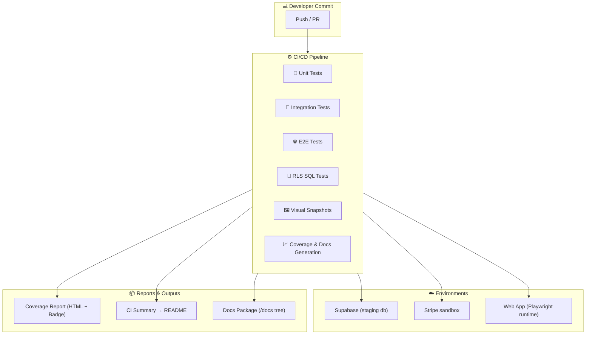

# 2.6 - 🧪 Phase D: Testing & Documentation (Section 6)

---

## **Context**

Following the Access (Section 4) and RLS Cleanup (Section 5), this phase establishes the **verification backbone** of NBCON PRO.

Every tier, API, and agent flow must pass automated tests before deployment — ensuring functional, data, and visual integrity across the stack.

---

## 🎯 **Objectives**

- Guarantee **100 % stability** across all functional modules.
- Build **automated multi-layer test pipelines** (unit + integration + E2E + RLS).
- Generate **complete developer/QA/ops documentation** from code.
- Certify Stripe ↔ Supabase ↔ UI synchronization.
- Deliver a **CI/CD test matrix** required for production gating.

---

## 🧩 **Deliverables**

| Deliverable | Description |
| --- | --- |
| **E2E Test Suite** | Full user journey: signup → subscription → AI interaction → payment |
| **Unit Tests** | ≥ 90 % coverage for utils, hooks, and services |
| **CI/CD Integration** | GitHub Actions / Supabase CI executing test + lint gates |
| **API Tests** | Backend + Stripe webhook + Supabase validation |
| **Documentation Package** | `/docs/tests/`, `/docs/api/`, `/docs/devops/`, `/docs/ui-ux/` generated from TSDoc + Swagger |

---

## ⚙️ **Implementation Plan**

| Step | Module / Area | Status | Notes |
| --- | --- | --- | --- |
| 1 | `tests/config/jest.config.ts` | ☐ | Unified config |
| 2 | Frontend unit tests | ☐ | Components / hooks / utils |
| 3 | Backend unit tests | ☐ | Services / middleware / Stripe |
| 4 | Supabase RLS tests | ☐ | SQL policy validation |
| 5 | Playwright E2E | ☐ | Login → Payment → Portal |
| 6 | CI workflow | ☐ | `.github/workflows/test.yml` |
| 7 | Lint & format | ☐ | ESLint + Prettier |
| 8 | Docs generation | ☐ | TSDoc + Swagger sync |
| 9 | UI snapshots | ☐ | Percy / Chromatic |
| 10 | Publish results | ☐ | Coverage + badge reports |

---

## 🧭 **Unified Testing Pipeline Diagram**



---

## 🧱 **Testing Layers**

| Layer | Framework | Purpose |
| --- | --- | --- |
| **Unit** | Vitest / Jest | Validate logic & helpers |
| **Integration** | Supertest + Supabase client | Test APIs + RLS behavior |
| **E2E** | Playwright | Simulate full user journey |
| **UI Snapshot** | Percy / Storybook | Detect visual regressions |
| **Performance** | Lighthouse CI | Check speed + bundle weight |

---

## 🧠 **Sample Test Definitions**

### Unit Test (Utilities)

```tsx
import { tierMeetsRequirement } from "@/utils/tierUtils";

test("pro meets basic", () => {
  expect(tierMeetsRequirement("pro", "basic")).toBe(true);
});

test("free does not meet pro", () => {
  expect(tierMeetsRequirement("free", "pro")).toBe(false);
});

```

---

### Integration Test (Stripe → Supabase Sync)

```tsx
it("updates subscription tier after webhook event", async () => {
  const res = await request(app)
    .post("/api/stripe/webhook")
    .send(mockInvoicePaidEvent);
  expect(res.status).toBe(200);
  const profile = await supabase
    .from("profiles")
    .select("subscription_tier")
    .eq("id", userId);
  expect(profile.data[0].subscription_tier).toBe("pro");
});

```

---

### E2E Test (Portal Workflow)

```tsx
test("free user upgrade flow", async ({ page }) => {
  await page.goto("/login");
  await page.fill("#email", "test@user.com");
  await page.click("#login");
  await page.click("text=Upgrade to Pro");
  await expect(page).toHaveURL(/checkout/);
});

```

---

## 🧪 **Coverage Matrix**

| Layer | Target Coverage | Framework | Output File |
| --- | --- | --- | --- |
| **Frontend Unit** | ≥ 90 % | Vitest | `/reports/frontend.html` |
| **Backend Unit** | ≥ 90 % | Jest | `/reports/backend.html` |
| **Integration** | 100 % core APIs | Supertest | `/reports/integration.log` |
| **E2E** | 100 % critical flows | Playwright | `/reports/e2e/` |
| **Visual Regression** | 100 % UI views | Percy | `/reports/ui-snapshots/` |

---

## ✅ **Section 6 Checklist**

| Task | Owner | Status | Notes |
| --- | --- | --- | --- |
| Configure frameworks | DevOps | ☐ | Vitest + Playwright |
| Write unit tests | Frontend | ☐ | Target ≥ 90 % |
| Write API tests | Backend | ☐ | Include Stripe + Supabase |
| Create RLS tests | DBA / QA | ☐ | Validate read/write rules |
| Implement E2E flows | QA | ☐ | Signup → Payment → AI |
| Integrate CI/CD | DevOps | ☐ | Run on every PR |
| Enable UI snapshots | Frontend | ☐ | Percy / Chromatic |
| Document results | QA | ☐ | `/docs/tests/TEST_MATRIX.md` |
| Add coverage badges | DevOps | ☐ | README update |
| Run perf tests | DevOps | ☐ | Lighthouse CI |

---

## 🔗 **Dependencies**

- **Follows:** Section 5 (Database & RLS Cleanup)
- **Feeds:**
    - Section 16 (Deployment & Verification)
    - Section 11 (Monitoring & Metrics)
    - Section 14 (Stripe Validation)

---

## ⚠️ **Risks & Mitigation**

| Risk | Impact | Mitigation |
| --- | --- | --- |
| Low test coverage | High | Enforce coverage threshold in CI |
| Flaky E2E tests | Medium | Retry 3× + stable seed data |
| RLS test failures | Medium | Reset test DB before run |
| Docs drift | Low | Auto-generate on release pipeline |

---

## 📚 **Artifacts**

- `/tests/TEST_MATRIX.md` — test suites + coverage
- `/docs/tests/Testing_Strategy.md` — unified policy
- `/docs/api/API_Test_Cases.md` — endpoint validation
- `/docs/devops/CI_Pipeline.md` — workflow details
- `/reports/coverage/index.html` — final report
- `/reports/ui-snapshots/` — visual baseline

---

## 🧠 **Key Takeaway**

This phase guarantees NBCON PRO’s **engineering reliability**.

Every line of code, API response, and UI element becomes **test-verified and documented** — forming the operational backbone for continuous, failure-free deployments in later phases.

---