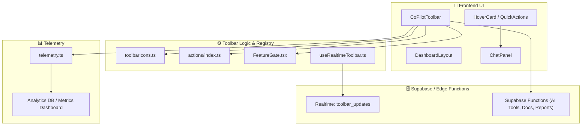

# 2.7 - ⚒️ Phase E: Toolbar & Enhancements (Section 7)

---

## **Context**

This phase converts the static dashboard into a **dynamic AI-powered workspace.**

The **CoPilot Toolbar** becomes the command layer where users can summon agents, execute quick AI tasks, and interact with Supabase in real time — creating a seamless connection between UI, intelligence, and backend events.

---

## 🎯 **Objectives**

- Build a **tier-aware modular toolbar** (Free → Enterprise).
- Integrate **AI Assist**, **Docs**, and **Agent actions** directly in the dashboard.
- Enable **hover-based Quick Actions** for key engineering workflows.
- Connect with **Supabase Realtime** for instant UI feedback.
- Prepare the toolbar to launch **context-aware AI agents** (Sections 8–9).

---

## 🧩 **Deliverables**

| Deliverable | Description |
| --- | --- |
| `CoPilotToolbar.tsx` | Base toolbar with icons, hover cards, and slots |
| AI Panel Integration | Chat/Agent control synced with toolbar |
| Feature-aware Buttons | Conditional rendering by subscription tier |
| Realtime Hook | Supabase Realtime sync for state + notifications |
| Quick-Action Registry | Centralized definitions for AI-driven shortcuts |

---

## ⚙️ **Implementation Plan**

| Step | File / Module | Status | Notes |
| --- | --- | --- | --- |
| 1 | `CoPilotToolbar.tsx` | ☐ | Floating toolbar container |
| 2 | `toolbarIcons.ts` | ☐ | lucide-react icons + registry |
| 3 | `HoverCard.tsx` | ☐ | Animated card (Framer Motion) |
| 4 | `ChatPanel.tsx` | ☐ | Connect toolbar AI entry |
| 5 | `actions/index.ts` | ☐ | Registry of AI quick-actions |
| 6 | `FeatureGate.tsx` | ☐ | Restrict actions by tier |
| 7 | `useRealtimeToolbar.ts` | ☐ | Supabase channel subscription |
| 8 | `telemetry.ts` | ☐ | Track action usage |
| 9 | `toolbarActions.spec.ts` | ☐ | Playwright hover/click validation |

---

## 🧭 **Unified System Flow Diagram**



---

## 💡 **Example Toolbar Component**

```tsx
export const CoPilotToolbar = () => {
  const { tier } = usePortalAccess();
  const actions = getAvailableActions(tier);

  return (
    <div className="fixed bottom-4 left-1/2 -translate-x-1/2
                    bg-background/80 backdrop-blur-xl rounded-2xl
                    shadow-xl flex gap-4 p-3">
      {actions.map((a) => (
        <HoverCard key={a.id} trigger={<a.icon />} content={a.tooltip}>
          <Button
            variant="ghost"
            onClick={() => a.execute()}
            disabled={!tierMeetsRequirement(tier, a.minTier)}
          >
            {a.label}
          </Button>
        </HoverCard>
      ))}
    </div>
  );
};

```

---

## 🧠 **Quick-Action Registry**

| Action | Description | Min Tier | File |
| --- | --- | --- | --- |
| **Project Charter** | Generate project summary | Free | `planCharter.ts` |
| **Risk Register** | AI-driven risk analysis | Basic | `riskRegister.ts` |
| **Budget Estimator** | Predict cost and timeline | Pro | `budgetEstimator.ts` |
| **Compliance Check** | Review contract safety | Enterprise | `complianceCheck.ts` |
| **Docs Panel** | Open contextual docs | Free | `docsOpen.ts` |

---

## 🔌 **Supabase Realtime Integration**

```tsx
useEffect(() => {
  const channel = supabase.channel("toolbar_updates");
  channel.on("broadcast", { event: "refresh" }, payload => {
    setToolbarState(payload.newState);
  });
  channel.subscribe();
  return () => channel.unsubscribe();
}, []);

```

🔹 Purpose: Toolbar updates dynamically on plan change, AI feature release, or usage alert.

---

## 🧪 **UI/UX Testing Scope**

| Test ID | Goal | Expected Result |
| --- | --- | --- |
| T-01 | Toolbar renders correctly | All icons visible per tier |
| T-02 | Hover-card interactions | Smooth motion, correct tooltips |
| T-03 | Tier gating | Locked icons show upgrade CTA |
| T-04 | Realtime updates | Toolbar state syncs instantly |
| T-05 | Telemetry event | Logs appear in analytics DB |

---

## ✅ **Section 7 Checklist**

| Task | Owner | Status | Notes |
| --- | --- | --- | --- |
| Build toolbar base | Frontend | ☐ | Floating layout |
| Add icon registry | Frontend | ☐ | lucide-react |
| Connect chat drawer | AI Team | ☐ | Uses shared context |
| Add quick-actions | Backend | ☐ | Modularized registry |
| Integrate FeatureGate | Frontend | ☐ | Tier-based |
| Enable Realtime | Backend | ☐ | `toolbar_updates` channel |
| Add telemetry | DevOps | ☐ | Event logging |
| Write tests | QA | ☐ | Hover/click |
| Update docs | Docs | ☐ | `/Toolbar_Spec.md` |

---

## 🔗 **Dependencies**

- **Follows:** Section 6 (Testing & Documentation).
- **Feeds:**
    - Section 8 (AI Agent Training Plan).
    - Section 9 (Expanded AI Coverage).
    - Section 15 (Tier Visibility).

---

## ⚠️ **Risks & Mitigation**

| Risk | Impact | Mitigation |
| --- | --- | --- |
| Toolbar overload | Medium | Lazy-load actions dynamically |
| Tier gating errors | High | Unit test `tierMeetsRequirement()` |
| Realtime drop | Medium | Add reconnect + debounce |
| Performance lag | Low | Preload Framer Motion transitions |

---

## 📚 **Artifacts**

- `/src/components/CoPilotToolbar.tsx`
- `/src/ai/actions/`
- `/docs/ui-ux/Toolbar_Spec.md`
- `/docs/telemetry/Toolbar_Analytics.md`
- `/tests/e2e/toolbarActions.spec.ts`

---

## 🧠 **Key Takeaway**

The **CoPilot Toolbar** becomes the **command center** of NBCON PRO — bridging user interface, intelligence, and automation.

Every click, hover, and AI response flows through it, turning the static dashboard into an **interactive engineering cockpit.**

---