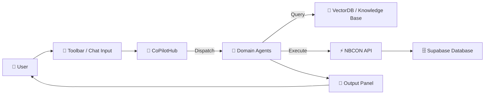
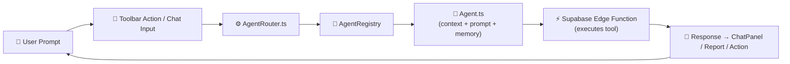

# 2.8 - 🤖 AI Agent Training Plan  (Section 8)

(balanced between the **conceptual vision** you wrote earlier and the **technical monorepo style** we’ve now standardized across the build).

Everything below is repo-ready and Notion-formatted — rich, structured, and fully aligned with Sections 1–7.

---

## 🎯 Objective

Train and deploy **domain-specific AI agents** that act as intelligent co-pilots for engineers, managers, and administrators — offering expertise, automation, and contextual support across all disciplines within **NBCON PRO**.

---

## 🧩 1. Purpose & Vision

Build a **multi-agent ecosystem** where each AI model specializes in a professional field — Civil, Electrical, Mechanical, GIS & Survey, Management, Finance, Safety, and more — all orchestrated through the unified **Co-Pilot Toolbar**.

Each agent learns dynamically from:

- Active project data
- User interactions and task history
- Standard engineering documents (drawings, BOQs, RFPs, reports)
- Organizational knowledge stored in Supabase / pgvector

These agents enable NBCON PRO to function as a **real-time, domain-aware engineering assistant**.

---

## 🧱 2. Agent Framework Structure

| Layer | Description |
| --- | --- |
| **Core Agent** | Base orchestration logic — context handling, routing, and memory management |
| **Domain Agents** | Specialized modules per discipline (Civil, Electrical, GIS, etc.) |
| **Knowledge Layer** | Vectorized document retrieval (Supabase pgvector / external Pinecone) |
| **Execution Layer** | Connects to NBCON data models & Edge Functions |
| **UI Layer** | Integrated via Co-Pilot Toolbar + chat panels |

---

## ⚙️ 3. Domains & Agent Roles

| Agent | Specialty | Capabilities |
| --- | --- | --- |
| **Civil Co-Pilot** | Civil Engineering | Design validation, BOQ generation, site-survey analysis |
| **Electrical Co-Pilot** | Electrical Systems | Load calculations, circuit design, system optimization |
| **Mechanical Co-Pilot** | HVAC & Plumbing | Duct sizing, pressure drop, maintenance schedules |
| **GIS & Survey Co-Pilot** | Geospatial | GNSS/LiDAR data interpretation, coordinate conversion |
| **Project Manager Co-Pilot** | Planning & Tracking | Timeline generation, resource allocation, KPI insights |
| **Finance Co-Pilot** | Cost & Budgeting | Forecasting, cash-flow tracking, variance analysis |
| **Safety Co-Pilot** | HSE & Risk | Hazard identification, safety plan verification |
| **Admin/Compliance Co-Pilot** | Documentation | Contract summaries, regulatory checks |

---

## 🧠 4. Data Training Pipeline

### Step 1 — Data Preparation

- Extract structured data from Supabase tables (`projects`, `tasks`, `users`, `finance`).
- Collect technical archives (reports, specs, SATECH library).
- Clean → label → vectorize for retrieval.

### Step 2 — Fine-Tuning / Prompt Optimization

- Train domain prompts (CivilGPT, MechGPT, etc.) on task–response pairs.
- Focus on contextual reasoning, not just text generation.

### Step 3 — Evaluation

- Three-tier QA: accuracy → relevance → tone.
- Human-in-the-loop feedback stored in Supabase.

### Step 4 — Continuous Learning

- Log user-approved responses for retraining.
- Quarterly refresh cycles per domain dataset.

---

## 🧮 5. Integration Architecture

### 🧭 Conceptual Flow

### ⚙️ Implementation Flow (in-repo)

Both flows together describe how prompts traverse from UI → Router → Agent → Edge → Response, forming the **Co-Pilot orchestration loop**.

---

## 🧩 6. Implementation Phases

| Phase | Description | Output |
| --- | --- | --- |
| **P1 – Prototype** | Build Civil & Electrical Agents | Working chat + vector retrieval |
| **P2 – Expansion** | Add Mechanical, GIS, Finance | Toolbar integration |
| **P3 – Management Agents** | Add Safety & Admin | Workflow automation |
| **P4 – Feedback Loop** | Human review → retraining | Quality improvement |
| **P5 – Production Sync** | Sync live data via Supabase | Real-time project intelligence |

---

## 🧪 7. Validation & Metrics

| Metric | Target |
| --- | --- |
| Response Relevance | ≥ 90 % (QA sessions) |
| Domain Accuracy | ≥ 85 % verified outputs |
| Latency | ≤ 2 s |
| Daily Adoption | ≥ 60 % active users |
| Retraining Cycle | 90-day refresh |

---

## ⚙️ 8. Implementation Plan & Checklist

| Step | Component / File | Status | Notes |
| --- | --- | --- | --- |
| **1.** Create registry (`registry.json`) | `/src/ai/agents/registry.json` | ☐ | Define agent metadata |
| **2.** Implement Base Agent Class | `/src/ai/core/Agent.ts` | ☐ | Shared context + memory |
| **3.** Build Civil Engineer Agent | `/src/ai/agents/civil.ts` | ☐ | Project charters / design |
| **4.** Build Electrical Engineer Agent | `/src/ai/agents/electrical.ts` | ☐ | Load calc / system design |
| **5.** Build Survey & GIS Agent | `/src/ai/agents/survey.ts` | ☐ | GNSS/LiDAR tools |
| **6.** Add Management & HSE Agents | `/src/ai/agents/management.ts` | ☐ | Risk + safety modules |
| **7.** Connect Edge Functions | `/functions/agents/*` | ☐ | Data execution hooks |
| **8.** Add FeatureGate Logic | `/src/utils/featureGate.ts` | ☐ | Tier restriction per agent |
| **9.** Write Tests & Benchmarks | `/tests/agents/*.spec.ts` | ☐ | Accuracy + latency metrics |
| **10.** Document Playbooks | `/docs/5-AGENT_PLAYBOOKS.md` | ☐ | Prompts + usage rules |

---

## 🧩 9. Dependencies

- **Follows:** Section 7 (Toolbar & Enhancements)
- **Feeds:** Section 9 (Expanded AI Coverage) and Section 16 (Testing & Deployment)

---

## ⚠️ 10. Risks & Mitigations

| Risk | Impact | Mitigation |
| --- | --- | --- |
| Prompt drift / inconsistent tone | Medium | Centralize system prompts |
| Context overflow (too large fetch) | High | Chunk retrieval + limit context size |
| Tier logic errors | High | Validate with `tierMeetsRequirement()` |
| Latency spikes from multi-agents | Medium | Cache + debounce Edge calls |
| Evaluation data insufficient | Low | QA sign-off per agent type |

---

## 🧾 11. Deliverables Checklist

✅ Multi-domain agent architecture

✅ Agent Registry & Router

✅ Supabase Edge Integration

✅ FeatureGate Tier Control

✅ Evaluation Matrix & Playbooks

✅ Documentation & Reports

---

## 📚 12. Artifacts to Produce

- `/src/ai/agents/*.ts` — Agent definitions
- `/src/ai/core/Agent.ts` — Base class
- `/src/ai/agents/registry.json` — Tier mapping
- `/functions/agents/*.ts` — Supabase Edge bindings
- `/docs/5-AGENT_PLAYBOOKS.md` — Playbooks + usage rules
- `/reports/agents/metrics.json` — Performance logs

---

## 🧠 13. Key Takeaway

Section 8 transforms NBCON PRO from a static platform into a **living ecosystem of specialized, context-aware AI engineers.**

Each agent is modular, tier-aware, and tightly integrated with Supabase data and Edge Functions — forming the foundation for continuous AI-assisted engineering, surveying, and management across every domain.

---

✅ **Section 8 — AI Agent Training Plan complete and production-ready.**

Would you like me to proceed with **Section 9 — Expanded AI Agent Coverage** next?