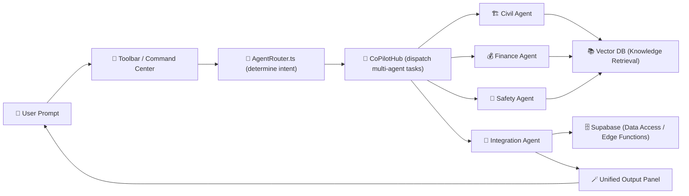

# 2.9 - 🌍 Expanded AI Agent Coverage (Section 9)

---

## 🎯 Objective

Expand NBCON Co-Pilot’s agent ecosystem beyond core engineering disciplines into cross-functional intelligence — ensuring **end-to-end automation**, **context-sharing**, and **real-time collaboration** between agents across all domains (engineering, finance, management, HSE, and enterprise operations).

---

## 🧩 1. Scope & Vision

Move from **domain-specific Co-Pilots** (Civil, Electrical, etc.) to a **federated multi-agent network** capable of:

- Coordinating tasks across engineering and business workflows.
- Sharing data context (projects, budgets, tasks, and analytics).
- Generating unified multi-discipline deliverables (drawings + reports + cost sheets).
- Scaling dynamically as new roles and datasets are introduced.

This turns NBCON Co-Pilot from a “collection of smart assistants” into a **living ecosystem of engineering intelligence**.

---

## 🧱 2. Agent Architecture Expansion

| Layer | Description | Implementation |
| --- | --- | --- |
| **Core Hub (CoPilotHub)** | Central dispatcher managing agent registration, auth, and context pooling. | `src/ai/hub/CoPilotHub.ts` |
| **Domain Agents** | Existing discipline agents (e.g. Civil, Electrical, Mechanical). | Linked via `AgentRegistry` |
| **Enterprise Agents** | New agents for Finance, HSE, Procurement, Admin. | Introduced in this phase |
| **Collaboration Agents** | Cross-discipline bridges (e.g. Project Integrator, Compliance Auditor). | Spawned by Hub via intent routing |
| **Meta Orchestrator** | Supervisory layer that balances agent workloads, merges outputs, and optimizes response time. | `src/ai/orchestration/MetaRouter.ts` |

---

## 🧠 3. Agent Network Coverage

| Category | Agents | Purpose |
| --- | --- | --- |
| **Engineering** | Civil • Electrical • Mechanical • Structural • Survey & GIS | Design validation and data automation |
| **Operations** | Project Manager • HSE • Maintenance | Scheduling • Risk • Compliance |
| **Finance & Procurement** | Estimator • Budget Analyst • Procurement AI | Costing • Bid analysis • Invoice checking |
| **Enterprise Management** | Admin • HR • Legal • Reporting | Documentation • Governance • Policy alignment |

---

## ⚙️ 4. Cross-Agent Collaboration Flow

**Explanation:**

This flow shows how multiple domain agents are invoked through `CoPilotHub`.

Each agent queries its own vector context, exchanges results via the Integration Agent, and produces a unified output to the user (report, dashboard, or design package).

---

## 🧮 5. Expansion Phases

| Phase | Focus | Output |
| --- | --- | --- |
| **E1: Enterprise Agent Integration** | Add Finance, Procurement, HSE agents with dataset links to Supabase | Agents live in registry + initial training |
| **E2: Cross-Agent Collaboration** | Enable CoPilotHub to dispatch multi-agent tasks and context sharing | Meta-Router prototype |
| **E3: Knowledge Unification** | Centralize vector embeddings for multi-agent context memory | Unified pgvector schema |
| **E4: Performance & Governance** | Logging • feedback • audit for each agent chain | Agent analytics dashboard |
| **E5: Production Deployment** | Agents available via toolbar and API gateway | Cross-discipline reporting live |

---

## 📈 6. KPIs & Success Metrics

| Metric | Target | Validation Method |
| --- | --- | --- |
| Cross-agent accuracy | ≥ 90 % | Randomized QA samples |
| Response time | ≤ 2.5 s | Performance logging |
| Integration success rate | ≥ 95 % | API monitoring |
| User adoption (weekly) | ≥ 70 % active engineers | Usage analytics |
| Retraining cycle | Quarterly | Auto-pipeline confirmation |

---

## 🧾 7. Deliverables Checklist

✅ Expanded AgentRegistry with ≥ 12 agents

✅ CoPilotHub multi-dispatch logic tested

✅ Meta-Router (Agent Orchestrator) prototype

✅ Unified pgvector store deployed

✅ Cross-discipline QA benchmark completed

✅ Agent analytics & logging dashboard

---

## 🧩 8. Key Takeaway

This phase evolves NBCON Co-Pilot into a **connected intelligence system** — where multiple AI specialists collaborate live through shared context and knowledge.

It lays the groundwork for **enterprise-level automation** to be extended in Section 10’s Implementation Roadmap and validated under Section 16’s Testing & Deployment Enforcement.

---